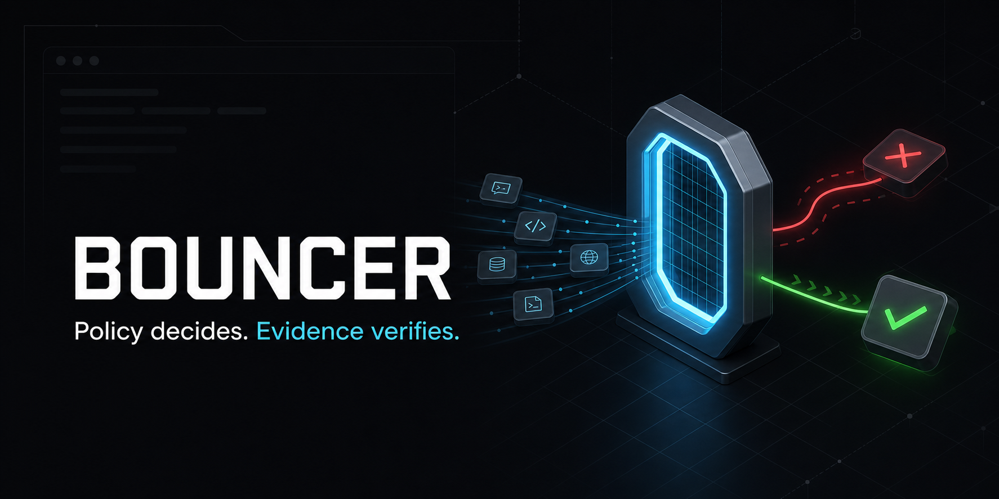
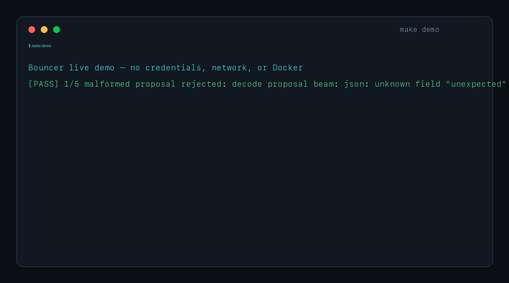
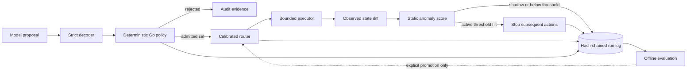

# Bouncer

> Deterministic authorization and evidence for AI-agent tool calls.

[](https://go.dev/)
[](https://www.python.org/)
[](LICENSE)



## The problem

Tool schemas can tell an agent that a field is a string. They cannot decide
whether this particular model, in this state, may write that string to this
path. Model output is stochastic and may be influenced by untrusted context, so
it should be treated as a proposal—not as authorization.

## What Bouncer does differently

Bouncer puts a deterministic control plane between model output and execution:

1. **Decode strictly.** Unknown fields, malformed actions, trailing content,
   and invalid beams fail closed.
2. **Authorize deterministically.** A canonical Go policy checks operations,
   paths, denied reads, protected mutations, dependencies, and mutation limits.
3. **Execute narrowly and verify.** Only admitted actions reach a virtual,
   remote, or rooted Linux executor; every transition is recorded in a
   lifecycle-complete SHA-256 event chain.

Routing—including optional learned routing—can reorder the admitted set. It can
never restore a rejected action.

## See it in seconds



```bash
make demo
```

That command uses real Bouncer packages to demonstrate five boundaries:
malformed proposal rejection, policy rejection, successful execution, tamper
detection, and learned-routing shadow mode. It needs Go 1.23+, but no API key,
network access, Python environment, Docker, or external model.

Expected final line:

```text
DEMO PASSED: 5/5 control boundaries behaved as expected
```

For the multi-process path:

```bash
docker compose -f compose.demo.yaml up --build --abort-on-container-exit --exit-code-from bouncer
```

## Three strongest verified results

| Result | What was verified | Boundary |
| --- | --- | --- |
| **100,000-case policy parity** | The canonical Go policy matched an independent Python reference on exactly 100,000 generated cases | Differential consistency, not a proof of policy completeness |
| **50/50 controlled fixture tasks** | The default single-proposer policy path completed every authored fixture with zero deliberately injected severe virtual mutations | Deterministic synthetic study, not real-world effectiveness |
| **3/3 hosted pilot tasks** | NVIDIA Nemotron completed three authored virtual tasks; five rejected proposals never executed and every event chain verified | One model, one seed, and no baseline: connectivity evidence, not an effectiveness benchmark |

The negative result matters too: a fixed 3×3 ensemble used **3.35×** the mean
synthetic tokens of the default without improving fixture completion or the
severe-mutation count. Bouncer therefore removed ensemble complexity from its
default path. See the [mechanism study](benchmarks/reports/mechanism.md),
[hosted pilot](benchmarks/reports/nvidia-hosted-pilot-2026-07-27/README.md),
and [claim register](docs/CLAIMS.md).

## How the boundary works



The authoritative runtime is deliberately simpler than the surrounding
research stack:

| Boundary | Owner | Guarantee |
| --- | --- | --- |
| Proposal contract | `internal/action`, `internal/nimclient` | Strict typed decoding and bounded candidate sets |
| Authorization | `internal/policy` | One fail-closed policy decision per candidate |
| Objective trust | `internal/calibration` | Provider estimates have zero influence in the bootstrap artifact |
| Routing | `internal/router` | Selects only from policy-admitted candidates |
| Execution | `internal/executor`, `internal/sandbox` | Transition verification, rooted access, and idempotency records |
| Post-execution circuit breaker | `internal/monitoring`, `internal/anomaly` | Immutable anomaly scoring can stop later actions but cannot undo the triggering transition |
| Evidence | `internal/eventlog` | One run identity, monotonic sequence, complete lifecycle, linked hashes |

Read the [system-design walkthrough](docs/SYSTEM_DESIGN_WALKTHROUGH.md) for the
full state machine and [transition-verification article](docs/ARTICLE_TRANSITION_VERIFICATION.md)
for a deep dive into the most security-sensitive loop.

## Why not just use tool schemas?

Schemas answer **“is this shaped like an action?”** Bouncer also answers:

- Is the operation allowed for this task?
- Is the target inside an approved root and outside protected paths?
- Is a read explicitly denied even when its target is inside an approved root?
- Were prerequisite reads, backups, or validations completed?
- Has the mutation budget been exhausted?
- Did the executor produce exactly the transition that was authorized?
- Can the run be reconstructed and checked afterward?

A valid JSON object can still describe an unauthorized action. Structure is a
necessary boundary, not an authorization system.

## Security and failure semantics

- **The model proposes; it never authorizes.** Model-authored risk, cost, and
  latency estimates are separated from trusted routing objectives. The default
  bootstrap gives them zero influence.
- **Idempotency can be indeterminate.** The sandbox claims a key before backend
  execution. If it fails before recording a result, Bouncer refuses a blind
  replay because the mutation may already have happened; reconciliation is
  required.
- **The hash chain is not a signature.** It detects modification, reordering,
  identity mixing, and suffix truncation. Detecting whole-chain replacement
  requires an externally stored final-hash anchor.
- **The rooted Linux executor is narrow.** `openat2` beneath/no-symlink lookup,
  hard-link denial, and bounded I/O reduce path attacks, but do not constitute an
  independently qualified general sandbox.

See the [threat model](docs/THREAT_MODEL.md), [protocol](docs/PROTOCOL.md), and
[production-readiness checklist](docs/PRODUCTION_READINESS.md).

## Optional learned routing

Bouncer includes portable generalized-linear outcome models, conservative
five-objective Pareto holding, shadow/active promotion modes, trajectory
builders, fitted-Q evaluation, bandit challengers, and an immutable Isolation
Forest circuit breaker. Authorization still happens first.

The checked-in learning artifact is a hand-authored **shadow-only wiring
fixture**. The CLI refuses to activate it. The implementation proves that the
mechanism is wired and conformance-tested; it does not prove improved real-task
outcomes.

Static anomaly detection is also disabled by default. Shadow mode records when
the frozen detector would stop a run. Active mode can stop only **subsequent**
actions after scoring a verified execution window; it cannot retroactively
block the action that produced that window. The checked-in anomaly artifact is
shadow-only, and this mechanism is not evidence of prompt-injection detection.

Start with [ML Routing Operations](docs/ML_OPERATIONS.md) for commands and
[ML Implementation Plan](docs/ML_IMPLEMENTATION_PLAN.md) for theory and
remaining promotion gates.

## Development and publication gates

Create the Python environment and run the normal development loop:

```bash
make bootstrap
make check
```

Before publishing a source revision:

```bash
make release-check
```

The release gate mechanically verifies tests, race detection, formatting,
linting, type checks, coverage ratchets, documentation links, tracked-secret
patterns, claim/report consistency, calibration digests, source fingerprints,
generated Markdown, complete pilot lifecycles, and externally recorded final
hashes. It intentionally fails when executable or evaluation source changes
without evidence regeneration.

Current local quality baseline:

- 51 Python tests and all Go tests with the race detector;
- 83.0% overall Go coverage;
- 92.9% policy, 91.1% router, 94.1% executor, and 90.8% anomaly-runtime coverage; and
- both production container images build successfully.

See [Development](docs/DEVELOPMENT.md), [Contributing](CONTRIBUTING.md), and
[Release](docs/RELEASE.md).

## Start here

| You are… | Read or run this first |
| --- | --- |
| **Recruiter or hiring manager** | `make demo`, then the [30-second project brief](docs/HIRING_GUIDE.md) |
| **Backend, platform, or security engineer** | [System Design Walkthrough](docs/SYSTEM_DESIGN_WALKTHROUGH.md) and [Threat Model](docs/THREAT_MODEL.md) |
| **AI/ML systems researcher** | [Claims & Evidence](docs/CLAIMS.md), [Research Protocol](docs/RESEARCH_PROTOCOL.md), and [Benchmarking](docs/BENCHMARKING.md) |
| **Contributor** | [Development Guide](docs/DEVELOPMENT.md), [Roadmap](ROADMAP.md), and [Contributing](CONTRIBUTING.md) |

## Project history and authorship

The project began with a narrow hypothesis: deterministic admission might
account for more safety value than expensive proposal ensembles. The controlled
study supported that hypothesis for authored fixtures, while later real-provider
runs exposed strict-completion failures and a trust hole in model-authored
objectives. Those failures changed the default design.

The [Project History & Authorship](docs/PROJECT_HISTORY.md) document records the
manual design responsibilities, use of development tools and AI assistance,
failed approaches, and why the history has not been rewritten to simulate a
different development process.

## Scope

Bouncer is a meticulous personal research prototype, not a production safety
proof. Stronger claims still require recognized external benchmarks, multiple
model families and seeds, real sandbox qualification, signed provenance,
independent reproduction, and external security review.

See the [public roadmap](ROADMAP.md), [changelog](CHANGELOG.md), and complete
[documentation index](docs/DEVELOPMENT.md#documentation-map).

## License

MIT. See [LICENSE](LICENSE).
