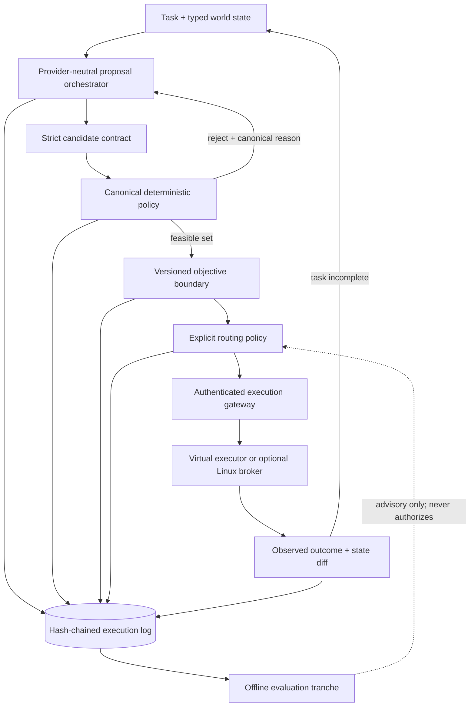

# Bouncer

> **A deterministic action-control plane and bounded execution gateway for AI-agent tool calls.**

[](https://golang.org)
[](https://python.org)
[](https://github.com/DarshGarg/Bouncer/actions/workflows/ci.yml)
[](LICENSE)

LLMs are useful action proposers, but poor authorization mechanisms: their
outputs are stochastic, can be influenced by untrusted context, and cannot
guarantee safety invariants.

**Bouncer** treats model-generated tool calls as untrusted proposals. It decodes
them into a strict contract, authorizes them through a fail-closed Go policy
engine, derives routing scores through a versioned objective artifact, executes
through a virtual or bounded backend, and preserves a tamper-evident SHA-256
event chain.

> [!NOTE]
> This repository is a research prototype evaluating control boundaries. It is not a production-hardened sandbox or a general safety proof.

---

## How It Works



For a narrative tour of the control loop, state machine, and transition verification, read the [System-Design Walkthrough](docs/SYSTEM_DESIGN_WALKTHROUGH.md).
For the short version, play the [75-second terminal demo](docs/DEMO.md).

---

## Architecture

Bouncer separates stochastic proposal generation from deterministic runtime
enforcement. Go owns the policy, routing, execution, and evidence boundaries;
Python provides an independent policy oracle and offline evaluation tools.

### Go runtime boundary

- **Fail-closed policy engine** (`internal/policy`): validates action contracts,
  target paths, allowed operations, dependency-DAG prerequisites, protected
  resources, and mutation quotas.
- **Versioned objective boundary** (`internal/calibration`): keeps provider
  estimates separate from routing inputs. The bootstrap artifact gives those
  estimates zero influence and uses explicit operation priors.
- **Rooted filesystem broker** (`internal/executor/rooted_linux.go`): narrows
  supported file operations with Linux `openat2` beneath/no-symlink resolution,
  hard-link denial, and bounded I/O.
- **Durable idempotency** (`internal/sandbox`): replays completed responses;
  claims without a recorded result fail closed and require reconciliation.
- **Tamper-evident events** (`internal/eventlog`): records one complete run
  lifecycle in a monotonic SHA-256 chain.

### Python evaluation boundary

- **Objective fitting** (`benchmarking/objective_calibration.py`): fits affine
  latency/cost transforms, a Platt risk transform, operation priors, and
  conservative influence weights on a deterministic held-out split.
- **Off-policy evaluation lab** (`benchmarking/ope.py`): implements IPS, SNIPS,
  clipping, and doubly robust estimators with support and weight gates. Current
  validation uses prepared observations from a known-ground-truth simulation.
- **Differential parity testing**: verifies the Go policy against the independent
  Python reference across exactly **100,000 generated cases**.

---

## Quick Start

Requirements: Go 1.23+ and Python 3.11+.

```bash
make bootstrap
make check
```

`make bootstrap` creates `.venv`; `make check` validates fixtures, runs Go and
Python tests, checks formatting and static analysis, and builds all five binaries.
`make release-check` adds the coverage ratchet, documentation-link and credential
audits, report/claim consistency, source fingerprints, and hosted-pilot anchors.

Start the deterministic OpenAI-compatible simulator:

```bash
.venv/bin/python -m benchmarking.mock_nim_cli --port 8001
```

In a second terminal, run one virtual task and verify its completed log:

```bash
bin/bouncer-run \
  -endpoint http://127.0.0.1:8001/v1 \
  -task benchmarks/tasks/task-001.json \
  -event-log benchmarks/results/task-001-events.jsonl \
  -output benchmarks/results/task-001-result.json

bin/bouncer-verify-log \
  -event-log benchmarks/results/task-001-events.jsonl
```

---

## Key Design Decisions

### Untrusted model-authored objectives

Ordinary calibration is monotonic, so it cannot by itself stop a model from
reporting artificially low risk or latency. Bouncer type-separates raw estimates
from routing inputs, bounds them under a versioned artifact, applies operation
priors, and defaults provider influence to zero. The offline fitter selects a
nonzero influence only when transformed estimates beat those priors on held-out
measured observations. Each decision records the transformation and artifact
digest.

### Tamper-evident log provenance

Every run produces a JSONL stream where event $N$ contains the SHA-256 hash of
event $N-1$. The standalone verifier checks a single identity from `run.started`
through one terminal event and rejects modified, reordered, or suffix-truncated
chains. The chain is not signed; detecting complete replacement requires an
externally stored final-hash anchor.

### Optional OS isolation

The Kubernetes template targets a gVisor (`runsc`) RuntimeClass, drops
capabilities, uses a read-only root filesystem, applies resource bounds, and
combines that boundary with rooted `openat2` lookup. It remains an unqualified
reference deployment pending adversarial testing and independent review.

### Observability

- OpenTelemetry spans cover proposal, policy, routing, and execution, with W3C
  trace context propagated across HTTP boundaries.
- Decision events record run, task, trace, and span identity without storing
  prompts as span attributes.
- The sandbox exports Prometheus-compatible request, execution, replay, error,
  and aggregate-duration metrics.

---

## Empirical Findings & Ablations

We built Bouncer to test whether complex multi-proposer ensembles justified
their inference overhead. The controlled fixture study did not justify it:

> **In these synthetic fixtures, the deterministic policy boundary—not
> additional proposals—accounted for the observed safety result.**

### Policy-Held-Constant Study (50-Run Synthetic Fixtures)

| Configuration | Pass Rate | Severe Mutations | Mean Synthetic Tokens/Success | Relative Token Cost |
| :--- | :---: | :---: | :---: | :---: |
| **Single Proposer + Policy (Default)** | **100%** | **0/50** | **3,257** | **1.0x (Baseline)** |
| One Five-Action Beam + First Valid | 100% | 0/50 | 4,194 | 1.29x |
| Fixed 3×3 Ensemble | 100% | 0/50 | 10,915 | 3.35x |
| Adaptive 1→3×3 | 100% | 0/50 | 10,915 | 3.35x |
| Scalar / Pareto / ε-Pareto | 0% | 0/50 each | Not estimable | Not comparable |
| *Uniform Random-Safe (Control)* | *2%* | *0/50* | *4,941 (one success)* | *Not comparable* |

- **Fixed ensemble overhead was not justified in this study:** fixed 3×3 used
  3.35× as many mean synthetic tokens as the default with identical fixture pass
  and severe-mutation counts. Adaptive expansion triggered on every turn and
  therefore matched the fixed ensemble's cost.
- **The zero-influence bootstrap is intentionally weak:** scalar and Pareto
  strategies could not recover task progress from static operation priors. That
  negative result is why those routers are not the default and why empirical
  objective calibration remains a prerequisite for reconsidering them.
- **Single proposer + Go policy is the default:** the project follows its stop
  rule; wider beams, ensembles, and alternative routers remain explicit
  experiments.

A separate historical-semantics rerun reports 12,592 mean synthetic tokens per
success for the original 3×5 design. It uses a clearly labeled identity artifact
to reproduce the old self-report-driven selector. It is [reported separately](benchmarks/reports/synthetic-mvb.md)
and cannot be compared directly with the newer study, which holds policy constant
and uses the zero-influence bootstrap boundary.

<details>
<summary><b>Real-Provider Connectivity: NVIDIA Hosted Pilot (Nemotron-3)</b></summary>

On July 27, 2026, the calibrated single-proposer configuration passed **2/3
authored virtual tasks** using NVIDIA's hosted Nemotron 3 Ultra model:

- **23 proposal rounds** recorded.
- **8 rejected proposals** were never executed.
- **23,296 provider-reported tokens** on strictly parsed responses.
- **Zero severe virtual mutations** recorded.
- Every event chain terminated and verified.

Task 001 made the requested file change but exhausted eight turns after repeatedly
proposing an invalid directory target for `task.complete`; it is recorded as a
failure. That distinction is the point of the pilot: connectivity and strict
control-loop completion are not task effectiveness.

This used one model, one seed, the virtual executor, and no comparison baseline.
It is connectivity and control-loop evidence, not evidence of model quality or
production safety.

For raw artifacts, see the [NVIDIA Hosted Pilot Report](benchmarks/reports/nvidia-hosted-pilot-2026-07-27/README.md).
The archived July 26 pilot predates the objective-calibration boundary and is not
used as the current headline result.
</details>

<details>
<summary><b>Detailed Component Status & Security Boundaries</b></summary>

| Component | Current Implementation | Status / Qualification Boundary |
| :--- | :--- | :--- |
| **Candidate Protocol** | Strict typed beams, bounded sizes, unique IDs, trailing-content rejection, explicit `finish_reason` handling | Conformance-tested |
| **Policy Authority** | Go evaluator for operations, roots, protected paths, dependencies, and mutation limits | 100,000 generated cases match the Python reference |
| **Objective Trust** | Model estimates are type-separated from router inputs; a hashed artifact bounds, scales, and blends objectives | Default bootstrap gives model estimates zero influence; empirical fits are pending |
| **Routing Engine** | First-valid, safety-first lexicographic, weighted utility, Pareto-plus-utility, and ε-Pareto policies | Advanced strategies remain experimental after negative bootstrap results |
| **Compute Control** | Optional 1→N adaptive proposal expansion triggered by validity and objective-space spread | Experimental |
| **Provider Boundary** | OpenAI-compatible adapter + exact recorded-response replay adapter | Published three-task hosted smoke pilot: 2/3 authored virtual tasks passed |
| **Execution Boundary** | Reversible virtual executor, authenticated remote protocol, transition verification, and idempotency replay | Reference implementation, not a general host-tool sandbox |
| **Linux Broker** | `openat2` rooted lookup, no symlinks, hard-link denial, bounded I/O, no unrestricted shell commands | Linux-only adversarial tests; independent review pending |
| **Tamper Evidence** | Complete lifecycle, monotonic sequence, SHA-256 event chains, standalone verifier | Tamper, reorder, truncation, and mixed-identity tests pass; whole-chain replacement requires an external anchor |
| **Operations & Observability** | OTLP/HTTP traces, trace propagation, Prometheus metrics, pinned CI actions | Load, chaos, and recovery testing pending |
| **Offline Evaluation** | IPS, self-normalized IPS, clipped IPS, doubly robust estimation, bootstrap intervals, support gates | Validated in known-ground-truth simulation |

</details>

---

## Current Limitations & Roadmap

Bouncer is a research prototype. Stronger public or production claims require
the following milestones (see [docs/IMPLEMENTATION_PLAN.md](docs/IMPLEMENTATION_PLAN.md)):

- [ ] **Scale provider qualification:** expand the three-task hosted pilot across
  audited tasks and model families.
- [ ] **Incorporate external benchmarks:** integrate agent-task environments such
  as `τ-bench` and `AgentDojo`.
- [ ] **Harden OS isolation:** complete load, chaos, teardown, and adversarial
  testing of the Linux execution boundary.
- [ ] **Calibrate objectives:** replace bootstrap priors with measured latency,
  cost, and risk observations.
- [ ] **Run a pre-specified evaluation:** conduct powered paired experiments
  across models and task domains.
- [ ] **Obtain independent review:** reproduce the evidence-integrity and
  containment results outside the project.

---

## Repository Map

| Path | Responsibility |
| --- | --- |
| `internal/policy` | Canonical Go authorization engine |
| `internal/calibration` | Strict objective artifacts, bounded transforms, priors, and routing-score audit records |
| `internal/router` | Explicit strategies, Pareto ranking, propensities, and adaptive-signal support |
| `internal/provider` | Provider factory and exact recorded replay |
| `internal/executor` | Virtual, remote, and Linux rooted execution contracts |
| `internal/sandbox` | Sandbox server, redundant policy, durable idempotency, and metrics |
| `internal/eventlog` | Monotonic tamper-evident event chain and verifier |
| `internal/telemetry` | OTLP trace export and propagation |
| `constraint_projection` | Independent Python policy reference |
| `benchmarking` | Baselines, objective fitting, mechanism study, provider evaluation, and offline evaluation lab |
| `deploy/kubernetes` | gVisor-oriented sandbox deployment template |
| `benchmarks/reports` | Generated controlled-study artifacts |

---

## Documentation Index

*   **Getting Started & Operations**:
    *   [Development Guide](docs/DEVELOPMENT.md) – Quickest route to understanding the codebase and making changes.
    *   [Operations Manual](docs/OPERATIONS.md) – Deployment, configuration, and hosted-provider setup.
    *   [Contributing Guidelines](CONTRIBUTING.md) – Code style, PR guidelines, and test requirements.
*   **Architecture & Design**:
    *   [System Design Walkthrough](docs/SYSTEM_DESIGN_WALKTHROUGH.md) – Step-by-step tour of the control loop, state machine, and boundaries.
    *   [Core Architecture](docs/ARCHITECTURE.md) – Detailed description of the systems layout.
    *   [Threat Model](docs/THREAT_MODEL.md) – Trust boundaries, assets, and security controls.
    *   [Protocol Specification](docs/PROTOCOL.md) – API contracts and schema verification.
    *   [Architecture Decision Records (ADRs)](docs/adr/0001-deterministic-policy-authority.md) – Key design decisions and trade-offs.
*   **Research & Evaluation**:
    *   [Claims & Evidence Register](docs/CLAIMS.md) – Verifiable boundaries of what has been empirically proven.
    *   [Research Protocol](docs/RESEARCH_PROTOCOL.md) – Pre-specified hypotheses and experiment design.
    *   [ML Implementation Plan](docs/ML_IMPLEMENTATION_PLAN.md) – Future-only, gated learning-to-rank roadmap.
    *   [Benchmarking Suite](docs/BENCHMARKING.md) – Task environments, baselines, and evaluation parameters.
    *   [Observability & Telemetry](docs/OBSERVABILITY.md) – Metrics, trace propagation, and logs.

---

## License

MIT. See [LICENSE](LICENSE).
