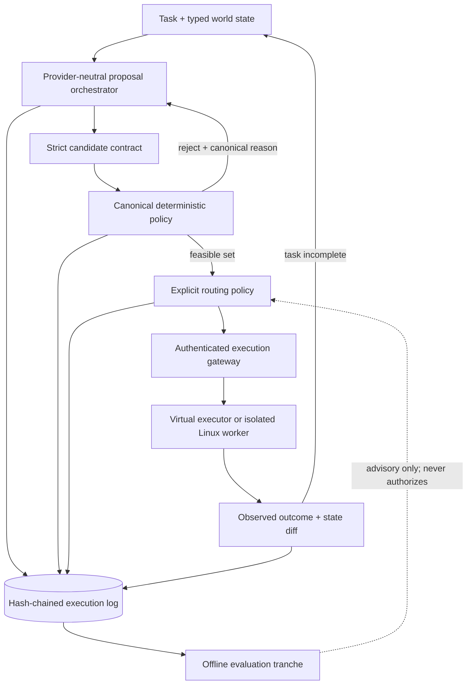

# Bouncer

**A deterministic action-control plane between an agent and the systems it can change.**

Language models are useful action proposers. They are not reliable authorization systems.

Bouncer treats every model response as untrusted input, converts it into a strict action contract, evaluates it with deterministic policy, selects only from the feasible set under an explicit routing rule, executes through a bounded gateway, and writes a tamper-evident record of what happened.

This repository is an evaluated research prototype. It is not presented as a production sandbox or a general safety proof.

## The problem

Tool calling makes model output machine-readable; it does not make the action correct or authorized. A syntactically valid call can still:

- target state outside the task boundary;
- skip an operational prerequisite;
- mutate protected resources;
- exhaust a mutation budget;
- select a needlessly risky valid action; or
- produce an unverifiable state change after a retry or partial failure.

Prompt rules and model judges leave a stochastic interpretation directly in front of mutation. Production logs then inherit the router's selection bias: naively learning causal structure or treatment effects from those logs can encode the router's own bias as if it were evidence about the world. Authorization, execution evidence, and offline learning therefore need separate trust boundaries.

## What is already built

| Layer | Implemented evidence | Qualification boundary |
| --- | --- | --- |
| Candidate protocol | Strict typed beams, bounded sizes, unique IDs, finite objectives, trailing-content rejection, explicit `finish_reason` handling | Conformance-tested |
| Policy authority | Canonical Go evaluator for operations, roots, protected paths, dependencies, and mutation limits | 100,000 generated cases match the independent Python reference |
| Routing | First-valid, safety-first lexicographic, scalar utility, Pareto-plus-utility, seeded random-safe, and ε-Pareto policies | Deterministic mechanism study only |
| Compute control | Optional 1→N adaptive proposal expansion triggered by validity and objective-space spread | Deterministic mechanism study only |
| Provider boundary | OpenAI-compatible adapter plus exact recorded-request replay adapter | Local contract tests; real-provider runner has no published result |
| Execution | Reversible virtual executor, authenticated remote protocol, transition verification, and durable idempotency replay | Reference implementation, not a general host-tool sandbox |
| Linux filesystem broker | `openat2` rooted lookup, no symlinks or magic links, hard-link denial, bounded I/O, no unrestricted commands | Linux adversarial tests and independent review still required |
| Evidence | Monotonic sequence, SHA-256 event chain, exclusive artifact creation, standalone verifier | Tamper/reorder tests pass |
| Operations | OTLP/HTTP traces, trace propagation, Prometheus-compatible sandbox metrics, pinned CI actions, race and fuzz gates | Load, chaos, recovery, and deployment SLO qualification remain open |
| Offline evaluation | IPS, self-normalized IPS, clipped IPS, doubly robust estimation, bootstrap intervals, support/weight/ESS/disagreement gates | Validated only in a known-ground-truth simulator |

## The gap—and what the measurements say

The original architecture assumed that more proposals and multi-objective routing would justify their cost. The first integration study did not support that assumption.

| Historical condition | Pass rate | Deliberately injected severe virtual mutations | Mean synthetic tokens/success |
| --- | ---: | ---: | ---: |
| LangGraph, unfiltered | 100% | 16/50 | 1,197 |
| Structured five-action, unfiltered | 100% | 16/50 | 3,010 |
| Original Bouncer 3×5 | 100% | 0/50 | 9,555 |

The deterministic fixture policy blocked the injected out-of-root mutations, but the original 3×5 ensemble used 698.2% more synthetic tokens than the LangGraph condition. That is integration evidence—not evidence about real models or general safety.

The current policy-held-constant study is more revealing:

| Current condition | Pass rate | Severe runs | Mean synthetic tokens/success |
| --- | ---: | ---: | ---: |
| Single proposer + identical policy | 100% | 0/50 | 2,169 |
| One five-action beam + Pareto utility | 100% | 0/50 | 3,182 |
| Adaptive 1→3 proposers, width 3 | 100% | 0/50 | 2,626 |
| Fixed 3×3 | 100% | 0/50 | 7,878 |
| Uniform random-safe | 50% | 0/50 | 3,279 |

The project follows its stop rule: **single proposer + deterministic policy is now the default.** Adaptive and ensemble modes remain experimental until real tasks show value. Uniform random-safe routing is a scientific control, not a recommended execution policy. See the generated [mechanism report](benchmarks/reports/mechanism.md) and [claim register](docs/CLAIMS.md).

For a narrative tour of the control loop, state machine, and transition
verification boundary, read the
[system-design walkthrough](docs/SYSTEM_DESIGN_WALKTHROUGH.md).

## The proposed solution



### 1. Deterministic admission

The model cannot grant itself a permission. The Go policy engine is authoritative and fail closed. It validates action shape, operation allowlists, portable virtual targets, allowed roots, protected resources, mutation quotas, and dependency-DAG prerequisites. Rejections are canonical machine-generated data; model prose is never copied into a policy decision.

Python is retained only as an independent differential oracle. It is not in the default hot path.

### 2. Explicit routing, not decorative optimization

Crowding distance preserves diversity; it does not define what the system values. Bouncer therefore exposes named routing semantics:

- `first_valid` for a minimal structured baseline;
- `lexicographic` for risk, then cost, then latency;
- `weighted_utility` for a versioned scalar objective;
- `pareto_utility` for Pareto reduction followed by explicit utility;
- `random_safe` as a uniform scientific control;
- `epsilon_pareto` for supported exploration among policy-passing Pareto candidates; and
- `legacy_crowding` only for replaying the historical study.

Every selection logs the eligible ranks, policy name, weights, risk ceiling, ε, seed, and exact behavior probability.

### 3. Adaptive compute

Experimental adaptive mode begins with one proposer and expands to the configured maximum only when a frozen trigger fires: too few valid candidates or insufficient objective-space spread. The trigger and extra calls are recorded. This keeps additional inference as a measurable intervention rather than an architectural constant.

### 4. Bound execution and verify the transition

Remote requests bind the complete state, policy, and selected candidate into a SHA-256 idempotency key. Before execution, the sandbox atomically claims the key; it then persists the first response and replays it across restarts. A crash that leaves a claim without a response is marked indeterminate and requires reconciliation—the side effect is not repeated automatically. The control plane accepts a response only when an independent deterministic replay produces the exact same next state and diff.

The optional Linux rooted backend narrows real filesystem access with `openat2`; the gVisor deployment template adds a non-root identity, read-only root, dropped capabilities, resource bounds, persistent idempotency state, and default-deny egress. Those mechanisms reduce the attack surface, but they do not replace adversarial validation or external review.

### 5. Evidence before learning

Events carry a monotonic sequence and a SHA-256 link to the preceding event. Removing, changing, inserting, or reordering a record breaks verification.

Off-policy evaluation is a separate offline package. ε-exploration occurs only among hard-policy-passing actions in reversible environments. IPS, self-normalized IPS, clipping, and doubly robust estimates are rejected when support, effective sample size, maximum weight, or estimator-agreement gates fail. Causal estimates cannot weaken policy.

## What this prototype contributes

Bouncer's defensible contribution is not “more agents.” It is a clean systems boundary:

1. **Policy is inspectable.** A stochastic model proposes; deterministic software authorizes.
2. **Complexity is removable.** The simplest policy-preserving configuration is the default because it won the current controlled study.
3. **Comparisons are falsifiable.** Strong baselines share the same policy and executor, so ensemble value cannot hide inside a safety mismatch.
4. **Retries do not erase provenance.** Durable idempotency, exact transition validation, and hash-chained logs make execution evidence auditable.
5. **Learning is subordinate to safety.** Exploration has explicit support and propensity; offline estimates are advisory and gated.
6. **Negative results improve the system.** The 3×5 result caused a design change rather than a marketing rewrite.

If real benchmarks show that the ensemble adds no value, Bouncer still succeeds as a compact deterministic control plane. If adaptive proposals help on genuinely ambiguous tasks, their benefit will be isolated and measured.

## Run the complete local path

Requirements: Go 1.23+, Python 3.11+, and the development dependencies in `pyproject.toml`.

```bash
make bootstrap
make check
make coverage
make build
```

`make bootstrap` creates `.venv` and installs the editable development package.
Subsequent Make targets automatically use that environment even when it is not
activated. The equivalent manual setup is:

```bash
python3 -m venv .venv
. .venv/bin/activate
python3 -m pip install -e '.[dev]'
```

For a credentialed NVIDIA-hosted pilot, use the frozen
`configs/run-manifest.nvidia-hosted.json` configuration and the instructions in
the [operating guide](docs/OPERATIONS.md#nvidia-hosted-api). Never commit `.env`.

Start the deterministic OpenAI-compatible simulator:

```bash
python3 -m benchmarking.mock_nim_cli --port 8001
```

In another terminal, run the evidence-producing default:

```bash
bin/bouncer-run \
  -endpoint http://127.0.0.1:8001/v1 \
  -task benchmarks/tasks/task-001.json \
  -event-log benchmarks/results/task-001-events.jsonl \
  -output benchmarks/results/task-001-result.json

bin/bouncer-verify-log \
  -event-log benchmarks/results/task-001-events.jsonl
```

Enable adaptive compute explicitly:

```bash
bin/bouncer-run \
  -endpoint http://127.0.0.1:8001/v1 \
  -task benchmarks/tasks/task-001.json \
  -proposers 3 \
  -beam-width 3 \
  -adaptive-proposals \
  -initial-proposers 1
```

Evaluate the implemented mechanisms and the known-ground-truth off-policy laboratory:

```bash
make evaluate-mechanisms
make evaluate-ope-simulation
```

## What remains before a strong public claim

- Run the frozen provider qualification against exact model and server revisions.
- Integrate and audit externally maintained task environments; the ten checked-in tasks remain smoke tests.
- Complete Linux adversarial containment, load, chaos, recovery, and rollback exercises.
- Add calibrated measured objectives; model-authored estimates are currently untrusted predictions.
- Run the preregistered paired experiment across task domains and model families.
- Obtain independent reproduction and security review.

The [research protocol](docs/RESEARCH_PROTOCOL.md), [threat model](docs/THREAT_MODEL.md), and [implementation plan](docs/IMPLEMENTATION_PLAN.md) define the promotion gates. None can be satisfied by documentation alone.

## Repository map

| Path | Responsibility |
| --- | --- |
| `internal/policy` | Canonical Go authorization engine |
| `internal/router` | Explicit strategies, Pareto ranking, propensities, and adaptive-signal support |
| `internal/provider` | Provider factory and exact recorded replay |
| `internal/executor` | Virtual, remote, and Linux rooted execution contracts |
| `internal/sandbox` | Authentication, redundant policy, durable idempotency, and metrics |
| `internal/eventlog` | Monotonic tamper-evident event chain and verifier |
| `internal/telemetry` | OTLP trace export and propagation |
| `constraint_projection` | Independent Python policy reference |
| `benchmarking` | Baselines, mechanism study, provider evaluation, and offline evaluation lab |
| `deploy/kubernetes` | gVisor-oriented sandbox deployment template |
| `benchmarks/reports` | Generated controlled-study artifacts |

## Documentation

- [Claims and evidence](docs/CLAIMS.md)
- [Architecture](docs/ARCHITECTURE.md)
- [System-design walkthrough](docs/SYSTEM_DESIGN_WALKTHROUGH.md)
- [Threat model](docs/THREAT_MODEL.md)
- [Research protocol](docs/RESEARCH_PROTOCOL.md)
- [Benchmarking](docs/BENCHMARKING.md)
- [Operations](docs/OPERATIONS.md)
- [Protocol](docs/PROTOCOL.md)
- [Observability](docs/OBSERVABILITY.md)
- [Architecture decisions](docs/adr/0001-deterministic-policy-authority.md)

## License

MIT. See [LICENSE](LICENSE).
