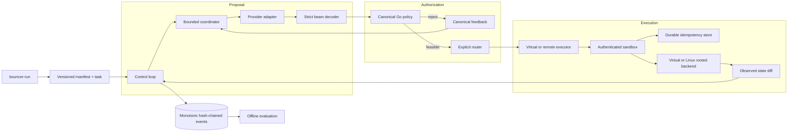

# Bouncer architecture

This document describes the implemented system. “Implemented” does not imply production qualification; evidence levels are tracked in [CLAIMS.md](CLAIMS.md).

## Design invariants

1. Model output is untrusted data and has no authorization authority.
2. The canonical Go policy is deterministic and fail closed.
3. Routing can choose only from candidates admitted by policy.
4. An execution response is accepted only if it matches the selected action's deterministic transition contract.
5. Every selection policy has explicit semantics and a logged behavior probability.
6. Statistical analysis is offline and cannot add permissions.

## Runtime topology

The default proposal budget is one proposer returning one action because it won the current policy-held-constant smoke study. Larger beams, multiple proposers, adaptive expansion, and exploratory routing require explicit flags.

## Trust boundaries

| Component | Trusted for | Not trusted for |
| --- | --- | --- |
| Provider | Producing candidate bytes and provider telemetry | Authorization, objective truth, or execution |
| Decoder | Contract shape, bounded size, local numeric validity | Semantic policy |
| Go policy | Declared operation, path, dependency, protection, and mutation rules | Undeclared environmental facts |
| Router | Reproducing the configured choice among admitted candidates | Calibrating model-authored objectives |
| Remote gateway | Protocol authentication and response binding | General operating-system containment |
| Rooted backend | Narrow Linux filesystem mediation | Arbitrary commands, arbitrary network tools, or a formal isolation proof |
| Task oracle | Scoring one fixture | General task correctness |
| Offline estimators | Estimating supported policy values from logged data | Live authorization or hidden-confounding removal |

## Proposal plane

`internal/provider` exposes a provider-neutral `Propose` contract. The OpenAI-compatible adapter implements bounded retry, reasoning-budget dialects, strict response limits, exact finish-reason classification, provider usage, and trace propagation. The recorded adapter returns a response only when task, proposer, seed, instruction, and typed state match an immutable record.

`internal/harness` assigns stable proposer identities and seeds, issues concurrent calls under one round deadline, cancels on failure, and returns results in deterministic proposer order. `ProposeRange` lets adaptive mode request a stable subset before expanding.

## Policy plane

`internal/policy` loads and validates the dependency DAG once. It rejects cycles and malformed operations at startup. Per candidate it evaluates:

- strict action shape and supported operation class;
- the task operation allowlist;
- portable relative virtual paths;
- allowed-root containment;
- protected-path mutation;
- mutation budget; and
- DAG and declared prerequisites.

Violations are sorted and serialized canonically. The Python package implements the same contract as an independent differential reference. `make verify-policy-parity` runs 100,000 generated cross-language cases.

## Routing plane

All candidates first pass the risk ceiling. Available policies are:

| Strategy | Selection semantics | Behavior probability |
| --- | --- | ---: |
| `first_valid` | First admitted proposal in stable input order | 1 |
| `lexicographic` | Lowest risk, then cost, latency, and candidate ID | 1 |
| `weighted_utility` | Lowest normalized weighted sum | 1 |
| `pareto_utility` | First nondominated front, then weighted utility | 1 |
| `random_safe` | Uniform over all admitted candidates | `1/n` |
| `epsilon_pareto` | Lexicographic best with `1-ε`; otherwise uniform among other Pareto-front candidates | Exact selected-action propensity |
| `legacy_crowding` | Nondomination rank, crowding, then ID | 1; historical replay only |

Crowding distance remains ranking metadata; it is not the default utility. Adaptive expansion uses the number of valid candidates and normalized objective-space spread. It logs every trigger and extra request.

## Execution plane

The virtual executor defines the typed state-transition contract. Remote execution sends the state, policy, candidate, and SHA-256 idempotency key to `/v1/execute`. The sandbox:

1. authenticates and bounds the request;
2. validates the idempotency header and request hash;
3. redundantly checks operation, root, protected path, and mutation policy;
4. atomically claims a new key before the backend runs;
5. serializes duplicate execution within the reference service;
6. returns a durable cached response when the key already completed;
7. fails closed on a claimed key with no completed response; and
8. atomically persists the response before returning it.

The caller independently replays the action against a cloned state and rejects any mismatch in next state or outcome.

On Linux, the optional rooted backend uses `openat2` with `RESOLVE_BENEATH`, `RESOLVE_NO_MAGICLINKS`, and `RESOLVE_NO_SYMLINKS`. It accepts regular files with one link, bounds I/O, and refuses unrestricted commands. The deployment template places it behind gVisor with non-root execution, dropped capabilities, read-only root, quotas, persistent idempotency storage, and default-deny egress. External qualification is still required.

## Evidence and telemetry

Event schema `0.2.0` includes a monotonically increasing sequence, previous hash, and current SHA-256 hash over canonical event content. `bouncer-verify-log` verifies schema, sequence, content, and every chain link.

OpenTelemetry spans cover proposal, projection, routing, and execution. W3C trace context propagates to provider and sandbox HTTP requests; trace and span IDs are added to decision events without capturing prompt content. The sandbox exposes Prometheus text metrics at `/metrics`.

## Offline evaluation boundary

`benchmarking.ope` implements IPS, self-normalized IPS, clipped IPS, and doubly robust estimates with deterministic bootstrap intervals. It refuses admission when target support is incomplete, effective sample size is too low, importance weights are too large, or estimators disagree beyond the frozen threshold. This package has no dependency edge into policy or execution.

## Failure semantics

- `finish_reason: length` is always truncation, even if partial content parses.
- Unknown or malformed beams fail the proposal; no repair prompt runs implicitly.
- A failed proposer fails its requested range.
- Policy or persistence errors fail closed.
- No valid candidate causes canonical feedback and replanning, never fallback execution.
- A mismatched sandbox response cannot update caller state.
- A corrupt idempotency record or event link is an error, not a cache miss.
