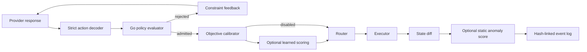

# Development guide

This guide is the quickest route from a fresh checkout to understanding one
complete Bouncer run. It focuses on where behavior lives and how to make a
change without crossing a trust boundary by accident.

## The shortest useful mental model

Bouncer has eight named stages, with learned ranking and statistical gating
remaining optional:

1. A provider proposes typed candidate actions.
2. The policy evaluator rejects candidates that violate declared constraints.
3. A trusted artifact converts raw provider estimates into routing objectives.
4. An optional immutable learning artifact predicts outcomes and constructs a conservative Pareto set.
5. The router selects one admitted candidate using a named strategy.
6. An executor applies the action to virtual or remote state.
7. Deterministic monitoring observes the verified outcome; an optional static
   anomaly scorer may stop subsequent actions.
8. The event log records the run and verifies that it ended cleanly.

The model participates only in step 1. It never approves its own action.



## Run one task locally

Install the development environment and build the binaries:

```bash
make bootstrap
make check
```

Start the deterministic provider simulator:

```bash
.venv/bin/python -m benchmarking.mock_nim_cli --port 8001
```

In another terminal, run one task:

```bash
bin/bouncer-run \
  -endpoint http://127.0.0.1:8001/v1 \
  -task benchmarks/tasks/task-001.json \
  -event-log benchmarks/results/development-events.jsonl \
  -output benchmarks/results/development-result.json

bin/bouncer-verify-log \
  -event-log benchmarks/results/development-events.jsonl
```

The two output files are ignored by Git. Delete or archive them when you are
done; published evidence belongs under `benchmarks/reports/` and follows a
separate review process.

## Follow a request through the code

| Stage | Start here | What to look for |
| --- | --- | --- |
| CLI assembly | `cmd/bouncer-run/main.go` | Manifest overrides and dependency wiring |
| Provider call | `internal/nimclient/client.go` | Request construction, retry, finish reason, strict beam decoding |
| Concurrent proposals | `internal/harness/coordinator.go` | Stable proposer IDs, seeds, deadline, ordering |
| Control loop | `internal/control/loop.go` | Turn lifecycle and failure propagation |
| Policy | `internal/policy/evaluator.go` | Operations, paths, dependencies, mutation limits |
| Objective calibration | `internal/calibration/calibration.go` | Bounds, transforms, operation priors, raw-versus-routing separation |
| Routing | `internal/router/router.go` | Risk ceiling, ranking, strategy semantics, propensity |
| Learned inference | `internal/learning` and `internal/router/learned.go` | Feature contract, artifact validation, uncertainty, and five-objective Pareto holding |
| Behavior monitoring | `internal/monitoring/rules.go` | Explainable rolling telemetry alerts |
| Static anomaly gate | `internal/anomaly` | Strict artifact loading and post-execution shadow/active scoring |
| Execution | `internal/executor/virtual.go` | Canonical state transition and state diff |
| Remote boundary | `internal/executor/remote.go` | Idempotency key and returned-transition validation |
| Evidence | `internal/eventlog/jsonl.go` | Run lifecycle, sequence, hash chain, terminal event |

The Python package in `constraint_projection/` independently implements the
policy contract. It is a differential oracle, not the default runtime policy.
If the Go behavior changes intentionally, update both implementations and run
the 100,000-case parity gate.

`benchmarking/objective_calibration.py` is an offline fitting tool. It may
produce a reviewed scoring artifact, but it has no authorization or execution
dependency. The checked-in bootstrap uses zero model influence because its
operation priors are engineering defaults rather than measured calibration.

`benchmarking/learning/` owns trajectory joins, supervised training, Markov
priors, vector FQE, bandit challengers, anomaly training, and the known-truth
simulator. Start with [ML Routing Operations](ML_OPERATIONS.md) before changing
that path. The Go/Python feature contract has one shared fixture at
`examples/learning-feature-fixture.json`; exact Isolation Forest scoring parity
uses `examples/anomaly-score-fixture.json`.

## Where tests belong

- Put focused Go tests beside the package they cover.
- Put Python unit and cross-process tests under `tests/`.
- Prefer a small table-driven test when several inputs share the same rule.
- Include at least one failure-path assertion for new boundary behavior.
- Test the externally visible contract rather than private implementation
  details whenever possible.

Useful commands:

```bash
make test                 # schemas, race-tested Go, and Python tests
make lint                 # go vet, Ruff, and strict mypy
make coverage             # current coverage ratchet
make verify-policy-parity # Go/Python differential gate
make fuzz-smoke           # bounded trust-boundary fuzzing
```

## Python style

Production Python follows PEP 8 and PEP 257. Ruff checks formatting, imports,
common correctness issues, and docstrings. A useful docstring explains the
contract or the reason a function exists:

```python
def load_task(path: str | Path) -> dict[str, Any]:
    """Load a task fixture and reject unsupported schema versions."""
```

Avoid line-by-line narration:

```python
# Bad: increment the counter by one.
counter += 1
```

Names and types should make routine mechanics clear. Reserve comments for
trust boundaries, frozen experiment rules, and behavior that would otherwise
surprise a maintainer.

## Changing a contract

Schemas, Go structs, Python mappings, manifests, and generated evidence often
describe the same data. Before changing a field, search for it across the
repository:

```bash
rg 'field_name' .
```

Then update the schema, both language implementations where applicable, test
fixtures, contract validation, and protocol documentation together. Run
`make check` before regenerating reports so a code error is not mistaken for an
experimental result.

## Evidence and claims

The checked-in reports do not all carry the same evidentiary weight. Read
`docs/CLAIMS.md` before editing the README or presenting a result. In
particular:

- deterministic smoke tests establish integration behavior;
- hosted-provider smoke runs establish provider and control-loop behavior;
- neither establishes production isolation or a general safety improvement;
- offline policy evaluation remains advisory and outside authorization.

When in doubt, describe exactly what ran, how many tasks it covered, and what
remains untested.

## Documentation map

- [System Design Walkthrough](SYSTEM_DESIGN_WALKTHROUGH.md): runtime and state-machine tour.
- [Architecture](ARCHITECTURE.md): packages, dependencies, and trust boundaries.
- [Transition Verification](ARTICLE_TRANSITION_VERIFICATION.md): deep technical article.
- [Threat Model](THREAT_MODEL.md): assets, attackers, controls, and residual risk.
- [Protocol](PROTOCOL.md): typed request, response, event, and idempotency contracts.
- [Claims & Evidence](CLAIMS.md): allowed wording and supporting artifacts.
- [Benchmarking](BENCHMARKING.md): controlled studies and evaluation methods.
- [ML Routing Operations](ML_OPERATIONS.md): data, training, evaluation, and promotion.
- [Production Readiness](PRODUCTION_READINESS.md): implemented versus unqualified controls.
- [Recovery and Reconciliation](RECOVERY.md): backup, restore, and indeterminate executions.
- [Project History](PROJECT_HISTORY.md): authorship, failed approaches, and design changes.
- [Hiring Guide](HIRING_GUIDE.md): concise explanations and interview preparation.

## Deeper test gates

`make fuzz-smoke` runs 10-second fuzz sessions across proposal decoding,
routing determinism, event verification, artifact validation, path
normalization, and idempotency collisions. Set `BOUNCER_FUZZ_TIME` to extend
each session.

Mutation testing is intentionally a slower scheduled gate. Install the pinned
tool used by `.github/workflows/mutation.yml`, then run:

```bash
go install github.com/jonbaldie/go-mutesting/v2/cmd/go-mutesting@v2.7.9
MUTATION_TOOL="$(go env GOPATH)/bin/go-mutesting" make mutation-check
```

It exercises the policy evaluator, router, and lifecycle verifier and requires
at least a 70% covered-code mutation score. Ordinary unit coverage is not a
substitute for this check.
