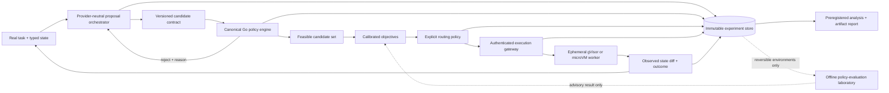

# Bouncer credibility and implementation plan

## Objective

Turn Bouncer from a well-engineered synthetic prototype into a credible, independently reproducible action-control system for tool-using agents.

“10/10” is not a branding target. It means every public claim is backed by a frozen artifact, every safety boundary has a threat model and adversarial test, every comparison uses strong baselines, and every production claim survives independent review.

The project succeeds even if the original multi-proposer hypothesis fails. If one proposer plus deterministic policy matches the ensemble, Bouncer becomes a compact policy-and-execution control plane and the ensemble is removed.

## Execution status — 2026-07-26

| Workstream | Status | Implemented evidence | Remaining gate |
| --- | --- | --- | --- |
| Credibility reset | Complete | README, claim register, threat model, protocol, ADRs | External artifact review |
| Canonical policy | Complete | Go authority; 100,000-case Python parity | Independent rerun |
| Explicit routing | Complete | Seven named strategies and exact behavior propensities | Real-task comparison |
| Adaptive compute | Implemented, experimental | Frozen validity/spread triggers; controlled mechanism report | Real-provider non-inferiority and overhead gate |
| Provider boundary | Implemented | OpenAI-compatible and exact recorded-replay adapters | Exact provider metadata and qualification |
| Evidence integrity | Complete for reference path | Durable idempotency restart replay; event sequence/hash verifier | Multi-replica transactional store and recovery drill |
| Linux execution | Implemented, unqualified | `openat2` rooted broker and gVisor deployment template | Linux adversarial suite and independent security review |
| Offline evaluation | Implemented, simulation-only | IPS/SNIPS/clipped/DR, bootstrap, overlap/ESS gates | Supported reversible real data |
| Observability | Implemented | OTLP traces, propagation, correlated events, Prometheus sandbox metrics | Load/chaos/SLO dashboards |
| External benchmarks | Not complete | Protocol and baseline matrix frozen | τ-bench, AgentDojo, and audited holdout runs |

The policy-held-constant smoke study activated the stop rule: one proposer + policy is the default. Fixed and adaptive ensembles remain explicit challengers. This is a completed engineering decision, not a real-model conclusion.

## Current audit

| Dimension | Current evidence | Current score | Principal gap |
| --- | --- | ---: | --- |
| Research validity | Preregistered synthetic comparison plus a policy-held-constant mechanism study and known-ground-truth OPE validation | 4/10 | No real-provider, external-benchmark, or independent replication evidence |
| Benchmark quality | Ten deterministic fixtures, five seeds, injected virtual hazards | 2/10 | Tasks are handcrafted for the mechanism and do not measure general agent capability |
| Feature quality | Typed actions, canonical policy, explicit strategies, exact propensities, adaptive compute, replayable loop | 7/10 | Objectives remain model-authored and uncalibrated; real-task routing value is unproven |
| Code quality | Race tests, strict typing, schemas, fuzz targets, coverage ratchet, cross-language differential testing | 7/10 | Overall coverage is 64.4%; CLIs still need application-package refactoring and integration coverage |
| Security | Fail-closed policy, durable idempotency, verified transitions, Linux rooted broker, gVisor template | 5/10 | Adversarial Linux qualification, transactional multi-replica execution, and independent review remain open |
| Operations | Hash-chained evidence, OTLP traces, Prometheus metrics, pinned CI, deployment template | 6/10 | Load/chaos evidence, recovery exercise, signed images, and enforced SLOs remain open |
| Documentation | Thorough architecture, protocol, benchmark, and operations documents | 6/10 | README is too promotional and does not separate claims from hypotheses sharply enough |
| Reproducibility | Frozen historical/current manifests, locked Go modules, generated reports, exact recorded replay | 6/10 | No immutable real-provider snapshot, release bundle, or external rerun |

## The 10/10 exit rubric

No dimension receives 10/10 because another document says it does. It receives 10/10 only after its gate is met.

| Dimension | Required exit evidence |
| --- | --- |
| Research validity | Preregistered protocol; powered multi-model experiment; confidence intervals and multiplicity policy; all runs and exclusions published; one independent reproduction |
| Benchmark quality | At least three task domains; externally maintained benchmark coverage; human-audited local tasks; hidden holdout; real provider usage; no deliberately planted primary-test hazards |
| Feature quality | Every routing stage justified by an ablation; calibrated objectives; explicit utility or lexicographic policy; adaptive compute; no layer retained solely for novelty |
| Code quality | At least 90% overall coverage and 95% in policy/router/executor; race tests; Go fuzz targets; Python property tests; command integration tests; compatibility policy; zero critical static-analysis findings |
| Security | Published threat model; ephemeral isolated workers; default-deny network; read-only root; resource quotas; symlink-safe filesystem operations; durable idempotency; adversarial escape suite; independent security assessment |
| Operations | OpenTelemetry traces/metrics/log correlation; defined SLOs; load and chaos evidence; backup/recovery drill; versioned deployment assets; rollback proven in staging |
| Documentation | README claim/evidence table; 30-minute clean-machine reproduction; ADRs; API and protocol versioning; limitations on the first page; zero broken links or stale generated results |
| Reproducibility | Locked dependencies; immutable images; SBOM, signatures, and provenance; hashed artifact release; cost ledger; deterministic analysis; external rerun from the release bundle |

## Target system



The production authorization path stays deterministic. Statistical or learned components may estimate objectives, but they cannot add an operation, path, permission, or dependency that policy rejected.

## Workstream 0 — credibility reset

**Duration:** 3–5 engineering days
**Dependency:** none
**Priority:** P0

### Deliverables

1. Replace the current README with a concise research-artifact README:
   - problem and narrow contribution;
   - implemented/evaluated/proposed matrix;
   - negative result above the fold;
   - one architecture diagram;
   - exact reproduction commands;
   - limitations and current readiness.
2. Add `docs/CLAIMS.md`, mapping every claim to a report, test, or external source.
3. Add `docs/THREAT_MODEL.md` with assets, trust boundaries, attacker capabilities, non-goals, and residual risks.
4. Add `docs/RESEARCH_PROTOCOL.md` and freeze hypotheses before real runs.
5. Add Architecture Decision Records under `docs/adr/` for:
   - deterministic policy authority;
   - final routing objective;
   - sandbox technology;
   - event integrity;
   - causal boundary.
6. Rename synthetic results “integration-study results” everywhere.

### Exit gate

- A reader can determine within two minutes what is implemented, what has been measured, what failed, and what remains hypothetical.
- No unqualified safety, causal, reliability, or production claim remains.
- A script fails CI when a README result disagrees with the referenced result JSON.

## Workstream 1 — simplify and harden the core

**Duration:** 2 engineering weeks
**Dependency:** Workstream 0 claims freeze
**Priority:** P0

### 1.1 One canonical policy implementation

The current production decision path crosses Go and Python and then partially repeats policy checks in Go. This creates semantic-drift risk.

Implement `internal/policy` in Go as the authoritative schema, operation, dependency, path, protected-resource, and mutation evaluator. Keep the Python projector temporarily as an independent reference and analysis tool.

Add differential tests that generate thousands of actions, states, and policies and require Go and Python to produce identical canonical decisions. Remove Python from the production hot path after parity is proven.

### 1.2 Correct routing semantics

Crowding distance preserves diversity; it should not define utility by itself.

Replace `router.Select` with explicit strategies behind a stable interface:

```go
type Policy interface {
    Select(context.Context, DecisionContext, []Candidate) (Selection, error)
}
```

Required strategies:

- `lexicographic`: minimize policy risk, then cost, then latency;
- `weighted_utility`: versioned user-supplied weights with sensitivity analysis;
- `random_safe`: uniform random selection for a scientific control;
- `pareto_utility`: Pareto reduction followed by explicit utility;
- `shadow_judge`: model-judge result logged but never authorized during evaluation.

Crowding remains available for maintaining a diverse proposal set or choosing which candidates to inspect, not as an unexplained final preference.

### 1.3 Adaptive proposal compute

Make 1×3 the starting budget. Request additional candidates only when a frozen trigger fires:

- fewer than two valid actions;
- low objective-space spread;
- calibrated uncertainty above threshold;
- disagreement between deterministic routing strategies; or
- no action below the risk ceiling.

Log the trigger and probability of every extra request. Compare adaptive compute against fixed 1×3, 3×3, and 3×5.

### 1.4 Testable commands and stable configuration

- Move each CLI’s logic into an importable internal application package.
- Keep `cmd/*/main.go` limited to flag parsing and exit handling.
- Add integration tests for every command, including failure exit codes and artifact permissions.
- Replace ad hoc flags with a versioned configuration object plus explicit CLI overrides.
- Add migration tests for protocol and manifest versions.

### Exit gate

- Go/Python policy parity holds for at least 100,000 generated cases.
- Critical policy, router, and executor packages each exceed 95% statement coverage.
- All command packages have success and failure integration tests.
- Adaptive routing is no worse than fixed 1×3 on pass/safety and uses no more tokens on the preregistered pilot.

## Workstream 2 — provider and evidence integrity

**Duration:** 1–2 engineering weeks
**Dependency:** stable candidate and run contracts
**Priority:** P0

### Deliverables

1. Introduce `internal/provider` with provider-neutral request, response, usage, finish-reason, retry, and capability types.
2. Move NIM-specific fields into `internal/provider/nim`.
3. Add a generic OpenAI-compatible adapter and contract-test server.
4. Record provider identity, model revision, server/container digest, tokenizer identity, reasoning dialect, request hash, response hash, attempt, and provider request ID.
5. Reject benchmark startup when required version metadata is missing.
6. Split provider qualification into:
   - 300-call integration gate;
   - at least 1,000-call reliability qualification;
   - sustained-concurrency load test.
7. Add server-side durable idempotency storage:
   - atomic claim of an idempotency key;
   - cached replay of the original response;
   - request-hash mismatch rejection;
   - expiry and storage-failure behavior;
   - crash-recovery tests.
8. Add monotonically increasing event sequence numbers and a per-run hash chain over canonical event bytes.

### Exit gate

- Zero accepted truncations or malformed beams in qualification.
- Every run is attributable to exact provider and artifact versions.
- Repeating an execution request cannot repeat the side effect.
- Removing, reordering, or modifying an event breaks evidence verification.

## Workstream 3 — real execution isolation

**Duration:** 2–3 engineering weeks
**Dependency:** durable idempotency and threat model
**Priority:** P0

The macOS development path remains virtual. Real-tool evaluation runs on Linux workers with an OCI-compatible sandbox runtime such as gVisor `runsc`; gVisor’s own security model emphasizes that sandboxing still requires cgroups and network policy, so those controls remain explicit.

### Worker contract

Each action receives a fresh or checkpointed ephemeral worker with:

- non-root user and no ambient capabilities;
- read-only root filesystem;
- explicit read-only and read-write mounts;
- no host Docker socket;
- no network by default, with destination allowlists when required;
- PID, memory, CPU, disk, file-count, and wall-clock limits;
- seccomp/runtime restrictions and `no_new_privileges`;
- symlink-safe and traversal-safe filesystem mediation;
- bounded stdout/stderr and structured tool result;
- forced teardown and post-run residue check.

### Tool adapters

Start with three narrowly scoped adapters:

1. filesystem read/write/delete through a rooted broker;
2. command execution from an allowlisted executable manifest;
3. HTTP requests through an egress proxy with method/host/path rules.

Do not expose an unrestricted shell as the first real backend.

### Adversarial suite

- `..`, absolute path, Unicode normalization, hardlink, and symlink escapes;
- fork bomb and process-tree cleanup;
- memory, disk, output, and file-descriptor exhaustion;
- metadata-service and loopback network access;
- environment and mounted-secret exfiltration;
- idempotency replay and concurrent duplicate requests;
- sandbox crash during mutation;
- maliciously inconsistent state diff.

### Exit gate

- Every adversarial case is blocked or contained with an attributable event.
- Worker teardown leaves no process, mount, network namespace, or writable layer behind.
- A separate reviewer reproduces the suite on a clean Linux host.
- Real tools remain disabled until an independent security assessment has no unresolved critical or high-severity finding.

## Workstream 4 — replace the benchmark

**Duration:** 3–4 engineering weeks plus annotation
**Dependency:** provider-neutral runner and isolated executor
**Priority:** P0

### Evaluation layers

#### Layer A: deterministic conformance

Keep the current ten fixtures, but rename them smoke tests. Expand them with generated and adversarial policy cases. They never support capability or real-world safety claims.

#### Layer B: externally maintained agent benchmarks

Integrate:

- **τ-bench** retail and airline tasks for policy-constrained tool-agent interaction;
- **AgentDojo** for utility under prompt-injection attack and defense conditions;
- one fresh or continuously refreshed software/tool benchmark only after task validity is audited.

Do not use SWE-bench Verified as the flagship evidence: OpenAI now reports that contamination and task-quality issues make it unsuitable for measuring current frontier coding capability. If coding tasks are added, use a fresh-task pipeline and publish the audit protocol.

#### Layer C: BouncerBench holdout

Create a domain-neutral benchmark specifically for action selection, not for prompting Bouncer’s known rules.

- 150–300 tasks across at least three domains;
- multiple genuinely valid actions with different cost/latency/risk trade-offs;
- hidden success and policy oracles;
- task authors separated from system implementers where possible;
- two independent annotations per task plus adjudication;
- pilot tasks excluded from the final holdout;
- documented invalid-task and exclusion process.

### Required baselines

1. single proposer, unrestricted execution;
2. single proposer plus the same deterministic policy;
3. structured beam plus the same policy, first valid action;
4. structured beam plus scalar utility;
5. structured beam plus random-safe selection;
6. model judge over the same eligible set;
7. Bouncer Pareto-plus-explicit-utility;
8. adaptive Bouncer;
9. an established framework-native agent where the benchmark provides one.

All baselines receive the same model, prompt information, tool schemas, permissions, maximum turns, timeout, and starting snapshot. Natural configuration is reported separately from equal-compute comparison.

### Experiment design

- At least three model deployments: the target open-weight deployment, a second independently developed model, and a strong hosted reference.
- Pilot first; calculate the final sample size from observed variance and the preregistered minimum effect, targeting at least 80% power.
- Paired task/seed comparisons.
- Primary metrics: task success, severe policy violation, total provider tokens, monetary cost, and end-to-end latency.
- Secondary metrics: false-block rate, valid-action recall, calibration error, retries, truncation, and human escalation.
- Confidence intervals for every primary effect.
- McNemar or paired bootstrap tests as appropriate; multiplicity correction for multiple primary comparisons.
- Report all exclusions, failed runs, and provider incidents.

### Promotion thresholds

- Pass-rate non-inferiority lower confidence bound no worse than −2 percentage points versus single proposer plus policy.
- At least 50% severe-violation reduction where the baseline has measurable violations, with an interval excluding zero improvement.
- No more than 15% median token overhead versus single proposer plus policy; otherwise the multi-proposer path is not the default.
- Deterministic routing overhead below 10 ms p95, excluding model and executor time.
- Results replicate on at least two model families and two task domains.

### Exit gate

- Raw traces, manifests, task versions, exclusions, cost ledger, and analysis code are released together.
- A second person can reproduce the headline table without editing code.
- The headline claim is the narrowest claim supported by the worst relevant domain/model result.

## Workstream 5 — objective quality and decision intelligence

**Duration:** 2 engineering weeks
**Dependency:** real benchmark pilot
**Priority:** P1

### Deliverables

- Separate model-estimated objectives from measured objectives at the type level.
- Compute cost from provider prices frozen at run time.
- Measure latency from trace spans rather than trusting candidates.
- Derive policy risk from deterministic rules and a separately calibrated advisory estimator.
- Add calibration plots, Brier score, expected calibration error, and reliability intervals.
- Add abstention/human-review as a first-class action when uncertainty or policy conflict is high.
- Add sensitivity analysis over utility weights and risk ceilings.
- Add regret analysis where an oracle action is available.

### Exit gate

- No model-authored number is presented as an observed measurement.
- A selected action includes a machine-readable explanation of constraints, feasible set, objective source, policy version, and tie-break.
- The advisory risk estimator improves held-out decision quality and is calibrated; otherwise it is removed.

## Workstream 6 — causal and off-policy laboratory

**Duration:** 2–3 engineering weeks after Workstream 4
**Dependency:** supported action taxonomy and sufficient reversible data
**Priority:** P2

This is an offline research package, not a production dependency.

### Scope

1. Define treatments as reusable routing or operation classes, never unique action JSON.
2. Enable epsilon exploration only among hard-policy-passing actions in reversible environments.
3. Log the full eligible set, exact behavior probability, policy version, context, and intervention label.
4. Implement and compare:
   - inverse propensity scoring;
   - self-normalized IPS;
   - clipped/stabilized IPS;
   - doubly robust estimation;
   - sequential estimators for multi-step trajectories.
5. Report overlap, propensity distribution, maximum weight, effective sample size, estimator disagreement, and confidence intervals.
6. Validate in synthetic environments with known treatment effects before using real logs.
7. Keep causal discovery separate. The PC algorithm is not required for policy evaluation and should be removed from the main story unless a distinct, validated structure-learning experiment justifies it.

### Admission gates

- Every evaluated action has non-zero support under the behavior policy.
- Effective sample size exceeds a preregistered fraction of the raw sample.
- Synthetic interval coverage is near nominal and bias is below a frozen tolerance.
- IPS, self-normalized IPS, and doubly robust conclusions do not materially conflict.
- Hidden-confounding sensitivity and sequential-dependence limitations are reported.
- No estimator can weaken deterministic policy.

## Workstream 7 — reliability, observability, and supply chain

**Duration:** 2 engineering weeks
**Dependency:** stable service boundaries
**Priority:** P1

### Observability

- Add OpenTelemetry spans for proposal, projection, routing, execution, persistence, and analysis.
- Correlate logs and metrics with run, task, action, policy, provider-request, and sandbox IDs.
- Export Prometheus-compatible counters and histograms.
- Treat prompts, state, and tool results as sensitive; content capture is opt-in and redacted.

### SLOs and resilience

- Freeze availability, terminal-event completeness, truncation, retry, p95 latency, and unauthorized-mutation SLOs.
- Add load tests for concurrency, large beams, large state, and provider throttling.
- Add chaos tests for provider timeout, projector failure, event-store failure, worker crash, duplicate request, and network partition.
- Exercise backup, restore, replay, and rollback in staging.

### CI and release security

- Pin all GitHub Actions by immutable commit.
- Add Linux/macOS test matrices where applicable.
- Run Go race tests, fuzz smoke tests, `govulncheck`, Python dependency audit, secret scan, CodeQL, and container scan.
- Enforce coverage thresholds.
- Generate an SBOM for each image.
- Produce signed images and build provenance.
- Publish checksums and a machine-readable release manifest.

### Exit gate

- Load and chaos reports meet frozen SLOs.
- A rollback exercise completes inside the recovery objective.
- Release verification rejects an unsigned image, modified SBOM, or mismatched provenance.
- No unresolved critical vulnerability exists in shipped code or images.

## Workstream 8 — publication-quality artifact

**Duration:** 1–2 engineering weeks plus external review
**Dependency:** all relevant promotion gates
**Priority:** P1

### Deliverables

- One-command artifact reproduction using immutable images.
- Public run bundle containing schemas, manifests, task hashes, traces, result tables, environment metadata, and cost ledger.
- Generated paper tables and figures; no manually transcribed headline numbers.
- Artifact DOI or immutable release archive.
- Reproduction guide tested on a clean machine.
- Independent replication note and security-review disposition.
- A short technical paper organized around the actual supported contribution and negative results.

### Exit gate

- Clean-machine reproduction finishes without undocumented steps.
- Every headline number traces to immutable raw records.
- An independent reviewer can identify the same limitations and reach the same statistical conclusion.

## Ordered implementation backlog

| Order | Work item | Depends on | Completion evidence |
| ---: | --- | --- | --- |
| 1 | Rewrite positioning and freeze claim/evidence map | — | README and `CLAIMS.md` review |
| 2 | Threat model and research protocol | 1 | Approved documents and frozen manifest |
| 3 | Canonical Go policy engine | 2 | Differential parity suite |
| 4 | Explicit routing strategies | 3 | Strategy unit/ablation tests |
| 5 | Refactor CLIs into testable application packages | 3 | CLI integration coverage |
| 6 | Provider-neutral interface and immutable provider metadata | 5 | Contract suite against two adapters |
| 7 | Durable idempotency and event hash chain | 5 | replay/crash/tamper tests |
| 8 | Linux isolated worker | 2, 7 | adversarial containment report |
| 9 | Adaptive proposal controller | 4, 6 | pilot ablation |
| 10 | External benchmark adapters | 6, 8 | τ-bench and AgentDojo smoke runs |
| 11 | BouncerBench authoring and audit | 2 | held-out task release manifest |
| 12 | Powered real-model experiment | 9–11 | immutable experiment bundle |
| 13 | Objective calibration and abstention | 12 pilot | held-out calibration report |
| 14 | Offline policy-evaluation laboratory | 12 data | estimator validation report |
| 15 | OpenTelemetry, SLO, load, and chaos work | 6–8 | operations qualification report |
| 16 | Supply-chain hardening | 5 | signed release, SBOM, provenance |
| 17 | Independent reproduction and security review | 12, 15, 16 | external reports |
| 18 | Publication artifact | all relevant gates | immutable release and paper |

## Schedule and staffing reality

For one full-time engineer/researcher, this is approximately 14–18 focused engineering weeks plus benchmark annotation, model cost, and external review time. Two people can parallelize the system/security track and evaluation/research track after the claim and protocol freeze.

Do not compress the plan by building the causal layer early. The critical path is:

```text
credible claim → canonical policy → real isolation → real tasks → powered comparison
```

Everything after that depends on what the comparison shows.

## Stop, pivot, and removal rules

- If single proposer plus deterministic policy matches Bouncer on capability and safety, remove the default ensemble path.
- If objective-space diversity does not predict outcome diversity, remove crowding from the decision path.
- If adaptive proposals cannot keep median overhead below 15%, position the system as an opt-in high-risk control mode rather than a default agent loop.
- If the isolated executor fails external review, do not expose real tools.
- If exploration has inadequate support or effective sample size, publish no causal effect claim.
- If a learned risk score does not improve held-out decisions, remove it.
- If an external benchmark is invalid or contaminated, exclude it under the preregistered rule and publish the exclusion.

## Definition of done

Bouncer is ready for a strong public release only when:

- the main README is narrower than the evidence, never broader;
- the strongest baseline receives the same policy and compute accounting;
- real providers and real tasks produce the headline result;
- the multi-proposer and Pareto layers each survive ablation;
- real execution is isolated and independently reviewed;
- evidence is immutable, attributable, and reproducible;
- operations meet measured SLOs under failure injection;
- causal language appears only beside validated causal evidence; and
- an independent person reproduces both the result and its limitations.

## Primary references guiding the plan

- [τ-bench repository and evaluation protocol](https://github.com/sierra-research/tau-bench)
- [AgentDojo paper](https://papers.neurips.cc/paper_files/paper/2024/file/97091a5177d8dc64b1da8bf3e1f6fb54-Paper-Datasets_and_Benchmarks_Track.pdf)
- [OpenAI’s audit of SWE-bench Verified](https://openai.com/index/why-we-no-longer-evaluate-swe-bench-verified/)
- [Inspect evaluation framework](https://inspect.aisi.org.uk/)
- [gVisor security model](https://gvisor.dev/docs/architecture_guide/security/)
- [OpenTelemetry Go](https://opentelemetry.io/docs/languages/go/)
- [OPA policy testing](https://www.openpolicyagent.org/docs/policy-testing)
- [Optimal and Adaptive Off-policy Evaluation in Contextual Bandits](https://proceedings.mlr.press/v70/wang17a.html)
- [Doubly Robust Off-policy Value Evaluation for Reinforcement Learning](https://proceedings.mlr.press/v48/jiang16.pdf)
