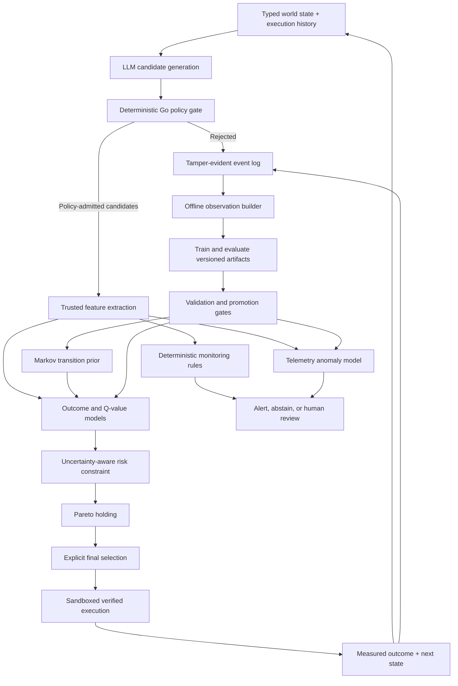

# Bouncer ML Implementation Plan

This document outlines the architecture for extending Bouncer from a deterministic, static control plane into a constrained, learning-to-rank system. The statistical model operates entirely inside a finite-horizon, multi-objective Markov Decision Process (MDP).

> [!IMPORTANT]
> This is a future implementation plan, not a description of checked-in runtime behavior. The current evidence supports the deterministic single-proposer path; every learned component below remains behind an explicit promotion gate.

The deterministic Go policy engine remains the sole authority. Machine learning models predict outcomes, maintain the Pareto frontier, and assist in selecting among already-safe actions. They never grant permission or override policy rejections.

---

## 1. Target Architecture



**Pareto holding** refers to retaining the uncertainty-adjusted, non-dominated candidate set until an explicit final selection policy is applied. It is treated as an infrastructure routing mechanism rather than a standard named algorithm.

---

## 2. Formal Decision Model

Define Bouncer as a multi-objective, finite-horizon MDP:

$$\mathcal{M} = (\mathcal{S}, \mathcal{A}_{safe}, P, \mathbf{R}, H)$$

Where:
*   **$\mathcal{S}$**: The state space consisting of the typed task state, execution history, remaining budgets, failures, and prior actions.
*   **$\mathcal{A}_{safe}(s)$**: The set of candidate tool calls admitted by the deterministic Go policy.
*   **$P(s' \mid s, a)$**: The transition dynamics of verified executor state transitions.
*   **$\mathbf{R}$**: A vector reward representing multiple trade-offs:
    $$\mathbf{R} = [\text{progress}, \text{task success}, -\text{latency}, -\text{cost}, -\text{adverse risk}]$$
*   **$H$**: The maximum task horizon or step limit.

Contextual bandits are deployed as the first approximation for immediate routing optimization. Trajectory-level Q models are introduced later to account for actions that deplete budgets, change available tools, or affect long-term task success.

---

## 3. Implementation Checklist

### Step 1: Freeze the Learning Contract
Before training any model, specify the schema definitions and reward bounds:
*   [ ] Define the state, action, next-state, reward, terminal-state, and horizon contracts.
*   [ ] Specify exactly which actions are eligible for ML ranking.
*   [ ] Establish that policy rejection always precedes ML scoring.
*   [ ] Define trusted measurements for latency, cost, progress, success, and adverse outcomes.
*   [ ] Decide how missing, censored, and delayed outcomes are represented.
*   [ ] Version the feature schema, reward definition, policy version, and learning artifact.
*   [ ] Start with a finite horizon and $\gamma=1$; introduce discounting only if experiments justify it.

*Exit Gate*: Every reward component can be computed directly from trusted executor or benchmark data without asking an LLM to judge itself.

---

### Step 2: Build the Observation Pipeline
To enable off-policy learning, every routing decision must be reconstructable from logged telemetry:
*   [ ] Log run, task, decision, and turn identifiers.
*   [ ] Log state features before routing.
*   [ ] Log the complete policy-admitted candidate set.
*   [ ] Log candidate features and calibrated objectives.
*   [ ] Log the selected candidate.
*   [ ] Log the exact behavior probability or propensity.
*   [ ] Log version digests of policy, feature, calibration, transition, and model artifacts.
*   [ ] Log immediate measured outcomes (latency, cost, progress).
*   [ ] Log delayed task-level outcomes (final success/failure).
*   [ ] Log verified next-state references.
*   [ ] Log explicit missingness and censoring markers.

*Exit Gate*: Benchmark trajectories can be reconstructed end-to-end, and every selected action can be joined to its measured outcome.

---

### Step 3: Implement the Feature Pipeline
Construct identical feature extractors in Go (for low-latency runtime serving) and Python (for offline training).

**State Features**:
*   Task and domain category.
*   Current turn and remaining turn budget.
*   Mutation and cost budgets.
*   Completed dependency operations.
*   Recent rejection, error, retry, and no-progress counts.
*   Previous tool operations.
*   Recent latency and state-change summaries.

**Candidate Features**:
*   Tool and operation type.
*   Whether it mutates state.
*   Target-resource category.
*   Dependency satisfaction.
*   Bounded argument type and size.
*   Calibrated latency, cost, and risk estimates.
*   Deterministic policy-risk indicators.
*   Markov transition features.

**Interaction Features**:
*   Candidate operation $\times$ task type.
*   Mutation $\times$ remaining mutation budget.
*   Tool $\times$ previous tool.
*   Estimated cost $\times$ remaining cost budget.
*   Risk $\times$ reversibility.

*Exit Gate*: Go and Python produce identical feature vectors from shared test fixtures.

---

### Step 4: Supervised Outcome Models
Begin with simple, inspectable baseline models rather than reinforcement learning:
*   **Classifiers**: Logistic regression for progress, success, and adverse outcomes.
*   **Regressors**: Ridge regression on log latency and log cost.
*   **Baselines**: Simple operation-level empirical priors.
*   **Challengers**: Gradient-boosted trees (evaluated offline).

The runtime output remains vector-valued:
$$\hat{\mathbf{v}}(s,a) = [\hat p_{\text{progress}}, \hat p_{\text{success}}, -\hat t, -\hat c, -\hat p_{\text{adverse}}]$$

Every prediction must include an uncertainty estimate or confidence interval. Evaluate models using trajectory- and time-based splits (not random event splits) measuring calibration, ranking regret, log loss, and adverse-event recall.

*Exit Gate*: Learned models outperform static operation priors and the lexicographic baseline on held-out test data.

---

### Step 5: Bounded Markov Transition Prior
Train smoothed sequence transition models over successful and failed trajectories:
$$P(a_t \mid a_{t-1}, \text{task domain}, \text{policy version})$$

*   [ ] Add explicit `START` and `END` states.
*   [ ] Begin with first-order transitions using Dirichlet/Laplace smoothing.
*   [ ] Add second-order transitions only if held-out likelihood improves.
*   [ ] Separate successful, failed, and incident trajectories.
*   [ ] Emit log probability, negative log-likelihood, unseen-transition indicators, and success/failure contrast.
*   [ ] Clip transition contributions so rare transitions cannot dominate routing decisions.

*Exit Gate*: The Markov prior improves held-out sequence likelihood in an ablation study.

---

### Step 6: Construct Trajectory Datasets
For each completed episode, assemble the trajectory logs:
*   [ ] Ordered state-action-next-state transitions.
*   [ ] Immediate vector rewards.
*   [ ] Terminal success or failure.
*   [ ] Reward-to-go for every objective.
*   [ ] Behavior propensities.
*   [ ] Policy and artifact versions.
*   [ ] Truncation and censoring status.

Reject broken or partially joined chains rather than silently treating them as complete trajectories.

---

### Step 7: Train Vector-Valued Q Models
Estimate one Q-function per objective instead of fitting one opaque scalar utility:
$$\hat{\mathbf{Q}}(s,a) = [Q_{\text{progress}}, Q_{\text{success}}, -Q_{\text{latency}}, -Q_{\text{cost}}, -Q_{\text{risk}}]$$

Use conservative confidence bounds (Lower Confidence Bounds for progress/success; Upper Confidence Bounds for latency/cost/risk). Abstain when uncertainty exceeds a configured threshold. Begin with fitted regression and Fitted Q Evaluation (FQE).

---

### Step 8: Implement Pareto Holding
The routing pipeline enforces a strict execution sequence:
1.  **Policy Filter**: Apply the canonical deterministic Go policy and dependency rules.
2.  **Feature Generation**: Generate trusted features and model predictions.
3.  **Risk Pruning**: Remove candidates violating an uncertainty-adjusted risk threshold.
4.  **Objective Bounds**: Convert remaining predictions to conservative objective values.
5.  **Dominance Check**: Compute the non-dominated set. Candidate $a$ dominates $b$ when it is no worse across all objectives and strictly better in at least one.
6.  **Redundancy Pruning**: Apply $\epsilon$-dominance or near-duplicate suppression.
7.  **Frontier Budgeting**: Limit oversized frontiers using objective-space crowding distance.
8.  **Selection Rule**: Apply the explicit final selector (e.g., lexicographic selection, frozen utility, or human review).
9.  **Log Output**: Log the frontier and the selection explanation.

*Exit Gate*: The Pareto router matches or exceeds the baseline pass rate while improving at least one of latency, cost, or risk, without degrading the others.

---

### Step 9: Multi-Layer Monitoring
Implement two distinct layers of telemetry defense:
1.  **Deterministic Rules**: Detect repeated policy rejections, no-progress loops, excessive retries, tool alternation, and hash-chain failures.
2.  **Statistical Anomaly Model**: Train an Isolation Forest over rolling telemetry windows (event proportions, rejection rates, no-progress streaks, latency deltas). Run in shadow mode first.

Promotion path:
$$\text{Offline evaluation} \longrightarrow \text{Shadow alerts} \longrightarrow \text{Alerts visible to operator} \longrightarrow \text{Abstention gate}$$

---

### Step 10: Safe Exploration
Introduce online exploration safely using this progression:
1.  Supervised ranking.
2.  Safe $\epsilon$-greedy exploration.
3.  Conservative LinUCB (where arms are candidate feature vectors $\phi(s,a)$).
4.  Linear Thompson Sampling.

All exploration must be restricted to the policy-admitted, uncertainty-safe set, budgeted per task, and backed by a deterministic rollback path.

---

## 4. Recommended Repository Structure

```text
schemas/
  routing-decision.schema.json
  measured-action-outcome.schema.json
  completed-trajectory.schema.json
  learning-artifact.schema.json
  anomaly-window.schema.json

internal/
  learning/
    features.go
    artifact.go
    linear.go
    uncertainty.go
    scorer.go
    shadow.go
  router/
    frontier.go
    dominance.go
    selection.go
  monitoring/
    rules.go
    anomaly.go

benchmarking/
  learning/
    observations.py
    outcomes.py
    markov.py
    fitted_q.py
    pareto.py
    anomaly.py
    bandits.py
    simulator.py
    evaluate.py
```
