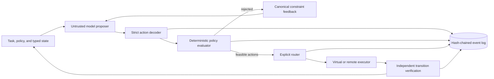

# Designing a deterministic control plane for AI-agent actions

An agent that can call a tool has crossed an important boundary: its output is
no longer merely text. A plausible-looking response might now overwrite a
configuration file, delete state, or trigger a deployment. JSON schemas make a
tool call machine-readable, but they do not make it authorized.

Bouncer is a personal research prototype built around one design rule:

> The model may propose an action, but deterministic software must decide
> whether that action is allowed.

The interesting part is not the model wrapper. It is the boundary between a
stochastic proposal and an attributable state transition.

## The system at a glance

The model receives the task, current state, and a read-only description of the
declared policy. Showing the policy helps it avoid obviously invalid proposals,
but does not give it authority: the Go evaluator independently applies the
policy to every candidate.

## The state machine

The prototype represents the world as a small typed state:

| Field | Purpose |
| --- | --- |
| `files` | Materialized virtual paths and contents |
| `completed_operations` | History used by the dependency DAG |
| `mutation_count` | Enforces the task's mutation budget |
| `constraint_feedback` | Canonical reasons rejected actions failed |
| `task_complete` | Terminates the control loop |

Actions use one contract regardless of which model proposed them. An action
names an operation class, tool label, target, arguments, declared dependencies,
and predicted latency, cost, and risk. Those objective values are treated as
untrusted estimates; they can influence routing among admitted actions but can
never add permission.

The dependency DAG captures operational prerequisites. For example, a write
requires a read, and task completion requires validation. The current file is
small enough to inspect directly in
[`configs/skill_dag.json`](../configs/skill_dag.json).

## One control-loop turn

Each turn follows the same sequence:

1. Serialize the current state and declared task policy.
2. Ask one or more proposers for a bounded candidate beam.
3. Reject malformed or truncated responses before policy evaluation.
4. Evaluate each candidate with the canonical Go policy.
5. Return canonical feedback if no candidate is feasible.
6. Select only among policy-passing candidates using the named routing rule.
7. Execute through the virtual executor or authenticated remote gateway.
8. Accept the result only after deterministic transition verification.
9. Record the decision and continue until completion or the turn limit.

There is no “best effort” fallback that executes a rejected action. If every
candidate fails, the state changes only by gaining constraint feedback.

## Why transition verification matters

Remote execution introduces a second trust problem. Even if the selected action
was authorized, the control plane should not blindly trust a worker's response.

Bouncer computes an idempotency key over the selected action, input state, and
policy. The reference sandbox claims that key before invoking its backend and
persists the first completed response. Retries replay that response rather than
repeating the side effect. A claim without a completed response is treated as
indeterminate and requires reconciliation.

The caller then replays the same typed action locally against a clone of the
input state. The returned state, created/modified/deleted path sets, mutation
classification, operation history, and completion flag must exactly match that
deterministic transition. A mismatch cannot replace caller state.

This is intentionally narrower than proving the worker is secure. It establishes
that the response is consistent with the selected action's modeled transition.
Operating-system containment remains a separate qualification problem.

## Evidence is a separate boundary

Every run records proposal completion, policy decisions, routing, execution,
and the terminal outcome as JSONL events. Events carry a sequence number and a
SHA-256 link to the previous event. The verifier recomputes those hashes rather
than trusting stored values.

The event stream is evidence for reproduction and debugging, not an authorization
input. Offline estimators consume separately prepared observations and cannot
change live policy.

## The negative result that simplified the design

The initial design emphasized three proposers returning five candidates each.
In the synthetic integration study, that 3×5 configuration preserved the fixture
outcomes but used far more synthetic tokens than the simpler baseline. A later
policy-held-constant study found that one proposer plus the same deterministic
policy was the lowest-cost passing configuration.

The default was therefore reduced to one proposer returning one action. Wider
beams, ensembles, adaptive expansion, Pareto routing, and exploration remain
explicit experiments. The control plane does not depend on them being useful.

That result captures the broader engineering lesson: safety value should be
attributed to the deterministic boundary, not bundled with extra model calls.

## What the prototype does not claim

Bouncer is not a production sandbox or a general agent-safety proof. The
checked-in benchmark tasks are authored smoke tests. The Linux rooted executor
is a narrow filesystem broker, not a general tool environment. Real-provider,
adversarial-containment, recovery, and independent-review work remain open.

The design contribution is smaller and more concrete: a model proposal can be
treated as untrusted input, passed through an inspectable authorization boundary,
executed under an explicit transition contract, and recorded with enough
structure to audit what the system believed happened.

## Where to go next

- Read the full [architecture](ARCHITECTURE.md) and [threat model](THREAT_MODEL.md).
- Inspect the canonical evaluator in
  [`internal/policy`](../internal/policy) and the transition checks in
  [`internal/executor/remote.go`](../internal/executor/remote.go).
- Reproduce the local path from the [operating guide](OPERATIONS.md).
- Compare supported and unsupported statements in the
  [claim register](CLAIMS.md).
