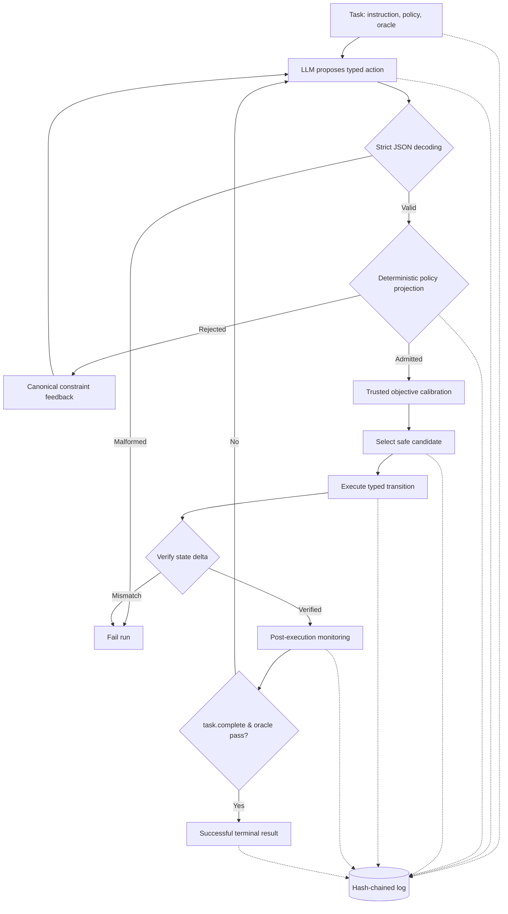

# System design walkthrough & architecture

> **A deterministic control plane for AI-agent actions.**

An agent that can call a tool has crossed an important boundary: its output is no longer merely text. A plausible-looking response might now overwrite a configuration file, delete state, or trigger a deployment. JSON schemas make a tool call machine-readable, but they do not make it authorized.

Bouncer is built around one central design rule:

> **The model may propose an action, but deterministic software must decide whether that action is allowed.**

The interesting part is not the model wrapper. It is the boundary between a stochastic proposal and an attributable state transition.

---

## Design Invariants

1. **Model output is untrusted data** and has zero authorization authority.
2. **Canonical Go policy is deterministic** and fail closed.
3. **Routing can choose only from candidates admitted by policy.**
4. **The router accepts trusted routing objectives**, never provider self-ratings directly.
5. **An execution response is accepted only if it matches** the selected action's deterministic transition contract.
6. **Every selection policy has explicit semantics** and a logged behavior probability.
7. **Statistical analysis is offline** and cannot add permissions.
8. **Runtime anomaly scoring observes verified outcomes**; active mode acts as a post-execution circuit breaker for subsequent actions, not authorization for or prevention of the triggering action.

---

## Control Loop & Runtime Topology

### The Seven Stages of Execution

The runtime carries a typed state through seven distinct stages:

1. **Proposal:** Obtain a strictly decoded candidate set from the LLM provider.
2. **Admission:** Evaluate every candidate with the canonical Go policy evaluator ([evaluator.go](../internal/policy/evaluator.go)).
3. **Calibration:** Derive trusted routing objectives under a versioned artifact ([calibration.go](../internal/calibration/calibration.go)).
4. **Routing:** Choose one candidate exclusively from the admitted set ([router.go](../internal/router/router.go)).
5. **Execution:** Submit the selected candidate and expected state identity to the virtual, remote, or rooted Linux executor ([executor](../internal/executor)).
6. **Verification:** Validate the observed state transition against the expected deterministic delta.
7. **Recording:** Append the decision and observed result to a tamper-evident SHA-256 hash chain ([jsonl.go](../internal/eventlog/jsonl.go)).

---

## Authorizing an Action Is Not Enough: Transition Verification

An AI agent can propose a valid operation, pass a policy check, and still cause the wrong state change if the executor is buggy, compromised, or operating on a different state than policy evaluated. Bouncer treats authorization and transition verification as separate boundaries.

### Expected vs. Observed State

The virtual executor applies the selected action to an in-memory typed state and returns a structured `StateDiff`:
- `created[]`
- `modified[]`
- `deleted[]`
- `completed_operation`

The remote executor boundary includes an idempotency key derived from the candidate and input state:
$$\text{IdempotencyKey} = \text{SHA-256}(\text{JSON}(\text{State}, \text{Policy}, \text{Candidate}))$$

The response is strictly decoded, matched to request identity, and validated before caller state is updated:

> **Invariant:** The runtime state advances only after the executor response has been decoded, attributed, and validated against the authorized request.

---

## Event Chain & Lifecycle Evidence

Every material stage emits a lifecycle event. Event $N$ includes the SHA-256 digest of event $N-1$, plus its own canonical content hash. The verifier enforces:
- The first event is `run.started`;
- Every event shares consistent run and task identities;
- Sequence numbers are strictly contiguous;
- No event follows a terminal event; and
- The log ends in exactly one `run.completed` or `run.failed` event.

**External Trust Anchors:** A hash chain is tamper-evident, but whole-chain replacement requires an external anchor. Bouncer exposes the terminal digest for independent external storage to detect full replacement.

---

## Sandbox Containment & Idempotency Semantics

### Rooted Linux Executor (`openat2`)
For host-level filesystem operations, Bouncer provides a rooted Linux executor backend ([rooted_linux.go](../internal/executor/rooted_linux.go)) utilizing:
- `openat2` with `RESOLVE_BENEATH` and `RESOLVE_NO_SYMLINKS`;
- Single-link checks to reject hard-linked targets;
- Bounded read/write buffer sizes;
- Explicit rejection of unrestricted shell commands.

### Idempotency & Ambiguous Failure (`409 Indeterminate`)
When a mutation request is submitted, Bouncer claims an idempotency key before invoking the backend, recording the result only upon durable completion. If a process or network crash occurs before recording:
- Bouncer treats the key as **`409 Indeterminate`**.
- It **refuses automatic retries** for indeterminate mutations, prioritizing state integrity over blind availability.

---

## Compatibility and Deprecation Policy

Before v1.0, Bouncer may change command flags, schemas, manifests, and event payloads between minor releases. Every breaking change must:
1. Increment the affected `schema_version` or artifact version;
2. Add a compatibility test or fail with an explicit migration error;
3. Document the migration in `CHANGELOG.md`; and
4. Preserve the old decoder for at least one minor release when doing so does not weaken a security boundary.

*Supported Toolchains:* Go 1.25+ and Python 3.11+. Linux is required for rooted-executor qualification; macOS supports the virtual development path.
