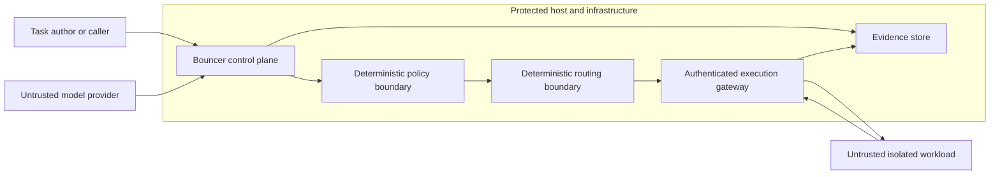

# Threat model

## Scope

This threat model covers Bouncer’s proposal, policy, routing, evidence, and execution boundaries. The default path uses in-memory virtual state. A narrow Linux rooted filesystem backend and gVisor deployment template now exist, but they are disabled by default and are not qualified production evidence.

## Security objectives

1. A model cannot directly authorize execution.
2. A rejected action cannot reach an executor through fallback behavior.
3. A caller cannot expand permissions by modifying an action, state, or policy after authorization.
4. Duplicate delivery cannot repeat a side effect.
5. An executor response cannot silently introduce an undeclared state transition.
6. Missing or corrupt evidence is detectable and fails the run.
7. Credentials, prompts, state, and tool results do not enter logs by accident.
8. A compromised workload cannot reach host resources outside its explicit execution grant.

## Assets

- task state and files;
- provider and sandbox credentials;
- policy bundles and dependency graphs;
- selected actions and tool arguments;
- execution outputs and state diffs;
- evidence logs, benchmark records, and release artifacts;
- model, provider, and infrastructure identity;
- host filesystem, network, process table, and control sockets.

## Trust boundaries

Model output, task content, tool output, benchmark input, and workload code are untrusted. The policy engine, routing configuration, execution gateway, evidence verifier, and release process are trusted components and therefore require the highest test and review coverage.

## Attacker capabilities

Assume an attacker can:

- control model-generated candidate fields and explanations;
- inject instructions through task state, files, tool results, or remote content;
- submit malformed, oversized, duplicated, reordered, or concurrent requests;
- exploit path encoding, traversal, symlinks, hardlinks, case differences, and Unicode normalization;
- cause provider timeouts, truncation, throttling, or inconsistent usage fields;
- crash an executor during a mutating operation;
- consume CPU, memory, processes, file descriptors, disk, or output quota;
- attempt network access to loopback, metadata services, private ranges, and arbitrary internet destinations;
- tamper with stored evidence after a run;
- operate arbitrary code inside a future sandbox workload.

Do not assume the model, executor workload, task author, or network is honest.

## Threats and required controls

| Threat | Required control | Current status |
| --- | --- | --- |
| Malformed or trailing model output | bounded response, finish-reason gate, strict typed decoder, exactly one document | Implemented for the current proposal protocol |
| Unauthorized operation or target | canonical deterministic policy evaluated before routing and redundantly at execution | Canonical Go policy implemented; external policy audit pending |
| Dependency bypass | versioned DAG and fail-closed dependency evaluation | Implemented; 100,000-case differential parity gate passes |
| Objective manipulation | treat estimates as untrusted, separate predicted from measured, risk ceiling, calibration | Not complete |
| Duplicate side effect | durable atomic idempotency claim, cached response, and fail-closed indeterminate state | Implemented for the single reference service; distributed transactional store pending |
| Forged executor transition | local deterministic transition verification and signed/attributable worker response | Virtual transition validation implemented; worker identity pending |
| Evidence deletion or reordering | sequence number, previous-event hash, event hash, terminal completeness check | Sequence and hash verifier implemented; external immutable storage pending |
| Path or link escape | rooted broker, Linux `openat2` beneath/no-symlink resolution, hard-link denial | Implemented behind Linux-only explicit backend; adversarial qualification pending |
| Process or kernel escape | ephemeral non-root gVisor or microVM worker, no host control socket, minimal mounts | Deployment template implemented; runtime qualification pending |
| Resource exhaustion | cgroup/process/output/disk/time limits and forced teardown | Kubernetes quotas and bounded I/O specified; load/teardown evidence pending |
| Network exfiltration | no network by default; explicit egress proxy rules | Default-deny Kubernetes policy specified; CNI enforcement test pending |
| Credential disclosure | secret manager, scoped workload identity, redaction, content logging off by default | Environment-variable development path implemented; production identity pending |
| Policy downgrade | signed/versioned policy, hash in decision and evidence, reviewed migration | Versioning partial; signing pending |
| Supply-chain compromise | locked dependencies, pinned CI, SBOM, scanning, signed images, provenance | Go modules and CI actions pinned; SBOM/signing/provenance pending |

## Security invariants

- Policy rejection is terminal for that candidate.
- Routing receives only policy-passing candidates.
- Learned or statistical output cannot add a permission.
- Execution input is cryptographically bound to action, state, and policy.
- Caller state changes only after response verification.
- Every mutation has an attributable selected action, policy decision, idempotency record, and observed diff.
- A run without a valid terminal event is incomplete.
- Real execution is disabled when isolation configuration cannot be verified.

## Residual risk

Even a hardened sandbox does not eliminate kernel, runtime, side-channel, infrastructure, or policy-authoring risk. gVisor itself documents the continued need for host resource controls and network policy. Security claims must state the tested attacker model, runtime version, host configuration, and unresolved findings.

## Promotion rule

The `command.run`, filesystem, and HTTP adapters may operate on real resources only after:

1. the isolated-worker implementation exists;
2. the adversarial suite passes on the release image;
3. staging load, chaos, teardown, and recovery tests pass;
4. a reviewer independent of the implementation resolves all critical and high findings; and
5. the release records the runtime, kernel, image, policy, and test artifact digests.
